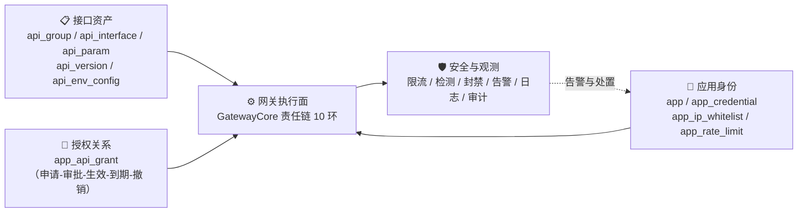
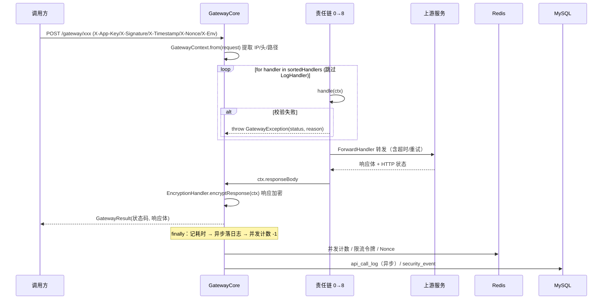
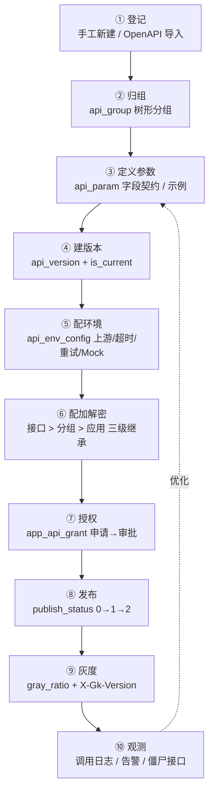
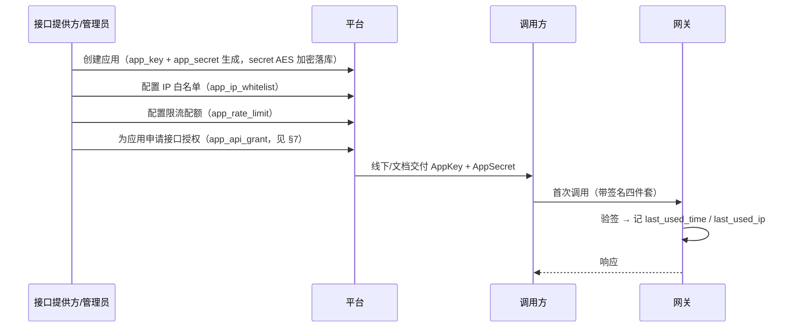
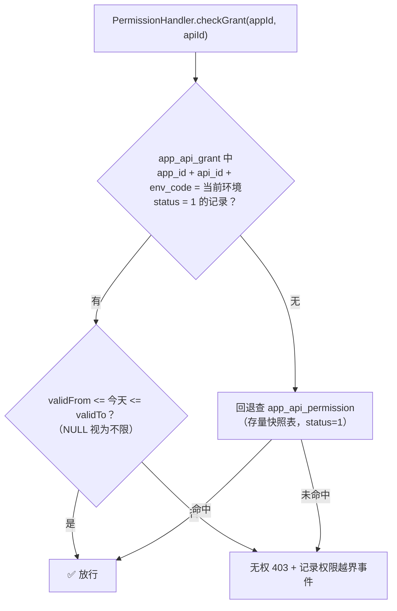
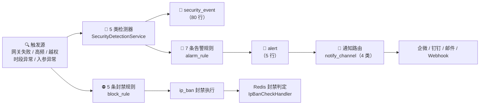
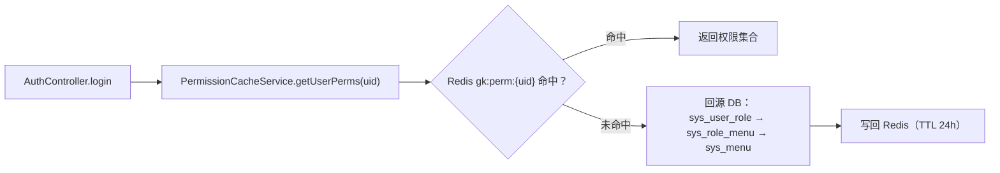

# GateKeeper 业务与核心流程

> 面向企业的 **API 全生命周期管理平台（APIM）** —— 业务全景 + 核心流程说明

| 项目 | 说明 |
|---|---|
| 文档版本 | v1.1 |
| 生成日期 | 2026-09-18 |
| 口径来源 | 源码（297 个 main Java / 86 个 test Java / 50 个 Vue）+ 线上库实测（`<db-host>:<db-port>`）+ `docs/` 既有契约记录 |
| 适用范围 | 产品/研发/测试/运维对接，作为"这个系统到底在做什么"的统一口径 |
| 时效声明 | 文中所有"实测"数据取自 **2026-09-18** 的线上库与 `d917570` 提交；表数量、行数、规则条数会随迭代变化，引用前请复核 |
| 修订记录 | **v1.2（2026-09-27 死代码清理）**：删除 49 个无调用端点 + 24 个前端 API 函数 + 14 个孤儿 Service 方法 + 8 个孤儿权限点（+39 条角色授权）+ `app_quota` / `biz_line` 两张死表建表语句 + 13 项无读取点 `sys_config`（`sys_config` 19 行 → 6 行）。§3.3 / §4.1 / §5.x / §10.5 / §11 / §13.2 / §13.4 / 附录 A 已同步为清理后口径<br>**v1.1（T19）**：修复 §13.2「配置脱钩」与 §13.3「`X-Gk-Env` 失效」两项实测缺陷 —— 新建 `SysConfigAccessor` 接线 6 项配置、`EnvResolver` 统一四级环境头优先级、修正 3 处错误种子值、其余 13 项如实标注「未接线（预留）」。§4.3 / §5.4 / §13 / 附录 A 已同步为修复后口径 |

---

## 0. 怎么读这份文档

- **只看业务** → 读 §1 §2 §3 §13
- **只关心网关怎么走** → 读 §4 §9
- **只关心接口怎么被管起来** → 读 §5 §6 §7
- **只关心安全与告警** → 读 §8
- **要对着库表理解** → 读 §11

> 一句话总纲：**网关是执行面，平台的核心资产是「接口 + 应用身份 + 授权关系」三张主数据。**
> 所有模块都在做三件事之一：把这三张主数据**录进来**（登记）、**管起来**（治理）、**用起来**（网关执行 + 观测）。

---

## 1. 项目定位与演进本质

### 1.1 一句话定位

GateKeeper 是一个**统一的 API 接口管理平台**：为企业的内部/外部接口提供**统一登记、统一鉴权、统一授权、统一安全防护、统一观测与审计**。

它对外呈现的是一个**网关**（所有调用都打到 `/gateway/**` 再转发到后端真实服务），但平台的真正价值不在转发，而在转发之外的四件事：

| 问题 | 平台给的答案 |
|---|---|
| 我们到底有哪些接口？谁负责？ | **接口资产台账**（分组 / 接口 / 参数 / 版本 / 负责人 / SLA / 标签） |
| 谁在调我们的接口？ | **应用身份台账**（应用 / 多密钥凭证 / 环境隔离 / IP 白名单） |
| 谁能调哪个接口？ | **授权关系台账**（申请 → 审批 → 生效 → 到期 → 撤销，带环境维度） |
| 调得怎么样？出事了怎么办？ | **观测与止损**（调用日志 / 5 类安全检测 / 7 类告警规则 / 动态封禁 / 限流配额） |

### 1.2 演进本质：从"管控"到"资产 + 治理"

```
┌─────────────────────────────┐        ┌─────────────────────────────────────┐
│  GateKeeper 原定位（2026/9 前）│        │  APIM 新定位（2026/9/10 起）          │
│  「API 集中权限管理与安全网关」  │  ──▶  │  「统一接口管理平台」                  │
│  关键词：管控                 │        │  关键词：资产 + 治理                   │
│  视角：拦得住就行             │        │  视角：有哪些、谁在用、变更过什么、出事怎么止损 │
└─────────────────────────────┘        └─────────────────────────────────────┘
```

这意味着**功能重心发生了位移**，但**执行面一行不重写**：

- 网关责任链、5 类安全检测、Redis fail-open 降级、百万级异步导出 → **原样保留**
- 新增的是**主数据的建模与治理能力**：环境维度、多密钥、授权状态机、灰度版本、接口加密、变更留痕

### 1.3 三张主数据 + 一个执行面



**读图要点**：三张主数据都是"人录入的、可治理的"；网关是"读这三位数据后做决策的"；安全与观测是"网关跑起来之后反向产生价值"的。改任何功能时先问：**它在治哪张主数据，还是在动执行面？**

### 1.4 六条演进铁律（不可违反）

| # | 铁律 | 落地要求 |
|---|---|---|
| 1 | **演进式重构，不推翻重写** | 网关责任链、安全检测、异步导出、fail-open 降级只补齐不重做 |
| 2 | **现有 Controller 一个不废弃** | 存量 27 个 Controller 全部保留，新能力以新增域 Controller 承载 |
| 3 | **现有表全部保留，只加不删** | 只加列 / 加索引 / 加新表；删列须有专门的下线脚本（如业务线） |
| 4 | **存量数据零迁移失败** | 所有迁移脚本必须**幂等**，可重复执行而不产生副作用 |
| 5 | **双套枚举语义不可混用** | `alert.status` 是**告警处理态**（0未读/1已读/2已处理/3已忽略）；`app.status` 是**启停态**（0停用/1启用/2过期）。两者数值含义完全不同 |
| 6 | **环境不可伪造** | 环境码不靠客户端传，由部署参数 `GK_ENV` + 凭证 `env_code` 二次校验共同保证 |

> 铁律 6 的工程含义：`X-Env` 请求头只是**解析入口**，真正的防线是"该应用在该环境下有没有活跃凭证"与"该应用在该环境下有没有授权"。

### 1.5 产品北极星指标

平台要让下面这些数字**可回答、可下钻**：

1. **接口覆盖率** —— 已登记接口 / 实际对外接口
2. **授权规范度** —— 走审批流程的授权 / 全部授权
3. **拦截有效性** —— 拦截的非法调用量 / 总非法尝试量
4. **MTTR（止损时长）** —— 从异常发生到封禁/告警生效的时间
5. **僵尸接口数** —— 30 天零调用的已发布接口

---

## 2. 角色与目标用户

系统预置 **9 个角色**（线上实测 `sys_role` 共 9 行），覆盖"平台方—业务方—外部分"三段：

| role_code | 角色名 | 定位 | 典型职责 |
|---|---|---|---|
| `SUPER_ADMIN` | 超级管理员 | 平台最高权限 | 全量菜单与按钮；**注意：后端无 `'*'` 通配**，超管也只是"被授了很多权限点"的角色 |
| `ADMIN` | 平台管理员 | 平台日常运营 | 应用/接口/权限/系统设置全量管理 |
| `OPERATOR` | 运维人员 | 稳定性与止损 | 日志排查、封禁、限流调整、环境与网关配置 |
| `SECURITY_AUDITOR` | 安全审计 | 安全视角只读 + 处置 | 安全事件、告警、封禁记录；越权取证 |
| `AUDITOR` | 审计员 | 合规审计 | 操作审计、调用日志，只读 |
| `BIZ_ADMIN` | 业务线管理员 | 按环境管数据 | **数据权限限定在 `ENV` 维度**（实测：`prod` / `test`） |
| `API_PROVIDER` | 接口提供方 | 资产录入方 | 登记接口、定义参数、配置环境与加密、看自己接口的调用情况 |
| `API_CONSUMER` | 接口调用方 | 资产消费方 | 申请授权、管理自己的应用与凭证、查调用日志 |
| `EXTERNAL_PM` | 外部对接人 | 外部项目对接 | 受限的应用与授权视图（已补授 `app:create` 以保零回归） |

**权限的三层收敛**：

1. **平台功能权限** —— `@RequirePerm("xxx")` 注解 + Redis 权限集合，决定"能不能点这个按钮"
2. **数据范围权限** —— `sys_role_datascope`（`scope_type` 如 `ENV`），决定"能看哪个环境的数据"
3. **接口可见性权限** —— `sys_interface_visibility` 白名单，决定"能看到哪些接口的路径与参数明文"

### 2.1 用户与子身份：两种"身份"不要混

| 概念 | 存在哪 | 代表什么 |
|---|---|---|
| **平台用户** | `sys_user` | 登录控制台的人（线上仅 1 个） |
| **应用** | `app` | 调用接口的"机器身份"（线上仅 1 个） |

平台用户和应用**是两个独立体系**：用户靠账号密码 + 权限点进控制台；应用靠 `AppKey + 签名` 调网关。二者仅在"谁是接口负责人""谁是应用负责人"这类**关联字段**上发生联系（`api_interface.owner_id`、`app.owner_id`）。

---

## 3. 业务域全景

### 3.1 侧边菜单 = 业务地图（权威来源 `src/frontend/src/router/menu.js`）

```
概览                          dashboard:view
应用管理                      app:list
接口管理   ├─ 接口分组         api:list
          └─ 接口列表         api:list
权限管理   ├─ 用户管理         sys:user:list
          ├─ 角色管理         sys:role:list
          ├─ 接口授权总览      grant:list
          ├─ 数据权限         sys:datascope:view
          └─ 操作审计         audit:list
系统设置   ├─ 环境与网关       env:list
          ├─ 安全策略         sys:security:view
          ├─ 字典管理         sys:dict:update
          ├─ 告警规则         sys:alarm:update
          ├─ 通知渠道         sys:notify:list
          ├─ 参数配置         sys:config:list
          └─ 日志与审计       sys:log:list
监控与审计 ├─ 调用日志         log:call:list
          ├─ 告警记录         alarm:list
          ├─ 封禁管理         block:list
          └─ 数据大屏         （无权限点，登录即可见）
开发者中心 └─ 接入文档         （无权限点，登录即可见）
```

**独立于布局之外的 3 个路由**（渲染时不经过 `Layout`，故页内没有侧边栏）：

| 路由 | 说明 | 入口 |
|---|---|---|
| `/login` | 登录页 | 无（未登录时自动跳转） |
| `/access-doc` | 对外公开的接入文档页（无 token 也能看） | 侧边栏「开发者中心 → 接入文档」 |
| `/screen` | 数据大屏（全屏投屏，页内含「返回控制台」） | 侧边栏「监控与审计 → 数据大屏」 |

> **修订（2026-09-29，v1.0.1）**：`/screen` 此前**没有任何侧边栏入口**，而前端是 hash 路由，
> 只能手输 `#/screen` 才能抵达，实际等同于该页不存在。现已在「监控与审计」下补入口
> （`perm: ''` 免权限，**不新增权限点**），并给大屏页加了「返回控制台」按钮 ——
> 否则从全屏页无法回到带侧边栏的布局。

隐蔽路由：`/encryption`（加解密管理，保留但不进侧边菜单，后续并入安全策略）。

> 🔴 **不要在前端页面里写死模块/权限清单**。菜单由 `MENU_TREE` 按登录用户的 `perms` 过滤生成；权限点唯一数据源是 `sys_menu.perm_code`。

### 3.2 八大业务模块

| 模块 | 业务问题 | 核心页面 | 关键表 |
|---|---|---|---|
| **① 概览** | 平台现在什么状态？ | 概览、数据大屏 | 聚合自 `api_call_log` / `alert` / `security_event` |
| **② 应用管理** | 谁在调？怎么调？ | 应用列表 | `app`、`app_credential`、`app_ip_whitelist`、`app_rate_limit` |
| **③ 接口管理** | 有什么接口？长什么样？ | 接口分组、接口列表 | `api_group`、`api_interface`、`api_param`、`api_version` |
| **④ 权限管理** | 谁能调什么？ | 用户、角色、授权总览、数据权限、操作审计 | `sys_user`、`sys_role`、`sys_role_menu`、`app_api_grant`、`sys_role_datascope` |
| **⑤ 系统设置** | 平台怎么配？ | 环境与网关、安全策略、字典、告警规则、通知渠道、参数配置、日志与审计 | `env`、`security_rule`、`sys_dict*`、`alarm_rule`、`notify_channel`、`sys_config` |
| **⑥ 监控与审计** | 跑得怎么样？出过什么事？ | 调用日志、告警记录、封禁管理 | `api_call_log`、`alert`、`ip_ban`、`security_event` |
| **⑦ 开发者中心** | 外部怎么接？ | 接入文档 | 由接口表 + 凭证 + 授权组合生成 |
| **⑧ 加解密** | 报文怎么加解密？ | 加解密管理（隐蔽路由） | `sys_encryption_config`、`api_*_encryption_config`、`app_encryption_config` |

### 3.3 业务线（biz_line）已于 T15 下线 —— 不要写进现行模块

`biz_line` 表与 `app.line_id` / `api_interface.line_id` 列，在**存量库**中物理保留（遵守"只加列不删列"铁律）；
**2026-09-27 起 `init.sql` 不再建 `biz_line` 表**（全仓 0 个 Java/前端引用，属死表）。除此之外：

- 权限点、侧边菜单、`sys_role_menu` 授权已在 `docs/sql/t15-remove-bizline.sql` 中删除
- Java 实体层已移除 `lineId` 字段映射
- **`BIZ_ADMIN` 角色名里的"业务线"是历史遗留命名**，实际能力已收窄为"按环境管数据"

> 引用菜单/模块清单时，**不要把业务线列为现行功能**。
> ⚠️ 历史脚本 `docs/sql/schema-v2.sql` 仍含 `CREATE TABLE IF NOT EXISTS biz_line` —— 按项目
> 「不追改历史迁移脚本」惯例未动，故走完整 Docker 初始化链时该空表仍会被建出（详见 README 表数口径）。

---

## 4. 核心流程一：网关请求链路（数据面）

这是整个系统**最核心的一条流程**：所有业务调用都经过它。

### 4.1 责任链 10 环节（权威顺序 = `@Order` 注解值）

| Order | Handler | 干什么 | 失败时 | 依赖 |
|---|---|---|---|---|
| **0** | `SysAccessWhitelistHandler` | 系统级访问白名单（网关入口全局前置校验） | 空表 = **不限制**；异常 **fail-open 放行** | `sys_ip_whitelist` |
| **1** | `AppAuthHandler` | ① AppKey 存在性 ② 应用状态 ③ 到期时间 ④ 签名/时间戳/Nonce 完整性 ⑤ 时间戳时效 ⑥ Nonce 防重放 ⑦ 签名校验 ⑧ 环境解析 ⑨ 活跃凭证探测 | 401 / 403 **拒绝** | `app` + Redis |
| **2** | `IpWhitelistHandler` | 应用级 IP 白名单 | 拒绝 | `app_ip_whitelist` |
| **3** | `IpBanCheckHandler` | 封禁检查（Redis 快速判定） | 拒绝；Redis 异常 **fail-open** | Redis `ip_ban` |
| **4** | `RateLimitHandler` | 令牌桶限流 + 日配额 | 拒绝（429 语义） | Redis + `app_rate_limit` |
| **5** | `PermissionHandler` | ① 按路径+方法+启用态匹配接口 ② 解析生效环境配置改写上游 ③ 授权校验 | 404（接口不存在）/ 403（无权） | `api_interface`、`app_api_grant`、`api_env_config` |
| **6** | `EncryptionHandler` | 入参解密 | 解密失败拒绝 | 三层加密配置 |
| **6** | `VersionRouteHandler` | 灰度版本路由（`appId` 稳定哈希分流） | 任何异常 **fail-open**，保留默认版本 | `api_version` |
| **7** | `AbnormalParamCheckHandler` | 异常入参检测（含安全检测联动） | 记录事件 / 按策略拒绝 | `security_rule` |
| **8** | `ForwardHandler` | 转发上游（超时 / 重试 / Mock 短路） | 上游错误原样透传 | `api_env_config` |
| **9** | `LogHandler` | 异步落库调用日志 | 不影响主链路 | `api_call_log` |

> ⚠️ **Order 6 有两个 Handler**（`EncryptionHandler` 与 `VersionRouteHandler` 同为 `@Order(6)`）。排序是稳定排序，二者相对次序取决于 Spring 注入顺序，因此**二者的执行先后不作为契约**。工程上二者互不依赖：一个解密入参，一个选版本写 `ctx.version`，没有共享可变状态。
>
> ⚠️ **`LogHandler` 不在循环里执行**：`GatewayCore.executeWithStatus()` 显式 `if (handler instanceof LogHandler) continue;`，把日志挪到 `finally` 里通过 `@Async` 异步执行。这样做的原因是日志落库不能占主链路耗时，**且拦截场景也要留痕**（被拦的请求同样要记日志）。
>
> 📌 文档一致性提示：`GatewayCore.init()` 的 Javadoc 写的是"白名单→封禁→认证→…"，与 `@Order` 实际顺序（白名单→**认证**→IP白名单→**封禁**→…）不一致。**以 `@Order` 注解为准**，该类方法注释属笔误。

### 4.2 链路全景（含拦截与兜底）



### 4.3 请求头契约

| 请求头 | 必需 | 含义 | 处理位置 |
|---|---|---|---|
| `X-App-Key` | ✅ | 应用标识 | `GatewayContext.from()` |
| `X-Signature` | ✅ | 请求签名 | 同上 |
| `X-Timestamp` | ✅ | 毫秒时间戳 | 同上 |
| `X-Nonce` | ✅ | 随机串（防重放） | 同上 |
| `X-Gk-Env` | ❌ | 环境码（**首选**） | `EnvResolver`（`AppAuthHandler` 调用） |
| `X-Env` | ❌ | 环境码（**兼容别名**） | 同上，仅在 `X-Gk-Env` 缺失时生效 |
| `X-Forwarded-For` | ❌ | 真实客户端 IP | 仅 `gatekeeper.security.trust-xff=true` 时解析 |

**签名算法（跨端固定契约：SM3）**：

```
X-Signature = SM3( AppKey + AppSecret明文 + X-Timestamp + X-Nonce )
```

- 自定义 SM3 实现（`CryptoService.digest("SM3", …)`），输出十六进制
- `AppSecret` 在库中以 **AES/ECB/PKCS5Padding 密文**存储，校验前先解密；解密失败时**回退按明文比较**（兼容未加密的历史行）
- 比较使用 `MessageDigest.isEqual()` **恒时比较**，防时序侧信道

**时间窗口、Nonce 与验签开关（T19 起改为 `sys_config` 可控）**：

| 项 | `sys_config` 键 | 种子值 | 代码默认（配置缺失时） | 说明 |
|---|---|---|---|---|
| 时间戳容差 | `sign.timestamp.tolerance` | `300000` ms | ±5 分钟 | ✅ 已接线，改配置即时生效（缓存 TTL 60s） |
| Nonce 有效期 | `sign.nonce.ttl` | `600` 秒（10 分钟） | 600 秒 | ✅ 已接线。**注意**：种子 600s 与旧硬编码 300s 不同，接线后实际窗口由 5 分钟放宽到 10 分钟（种子值即产品意图） |
| 签名算法 | `sign.algorithm` | `SM3` | 固定 SM3 | ⚠️ 读取但**只接受 SM3**；配成其它值会打 WARN 并回退 SM3 |
| 是否验签 | `gateway.auth.enabled` | `true` | `true` | ✅ 已接线，置 `false` 跳过防伪造/防重放 |

> ✅ **T19 已接线**：上表 4 项均由 `config/SysConfigAccessor.java` 在运行时读取（`sys_config` 唯一读取入口，本地缓存 60s，任何异常 fail-open 回退调用方默认值）。改配置后最多 60s 生效；通过「参数配置」页保存则会立即 `evictAll()` 生效。
>
> 🔴 **`gateway.auth.enabled=false` 的准确语义**：只跳过**防伪造 / 防重放**四步（头完整性、时间戳窗口、Nonce 去重、签名比对），**AppKey 存在性、应用启停状态、应用到期时间仍强制校验**。即关闭的是"签名校验"，不是"身份认证"。启动时若该开关为 `false`，`SecurityStartupCheck` 会打 **ERROR** 日志（刻意不阻断启动）。
>
> 🔴 **`sign.algorithm` 刻意不做真可切换**：签名算法是**跨端契约**（客户端 SDK、接口文档、`InterfaceTestServiceImpl` 自测全部按 SM3 实现），做成可切换等于留一个"改一行配置 → 全量验签失败"的开关。因此读取该配置仅用于**配错时告警并回退 SM3**，而非真的支持多算法。

> 🔴 **环境头口径（T19 已修复）**：环境解析统一走 `EnvResolver.resolve(ctx)`，四级优先级 —— **`X-Gk-Env` > `X-Env` > `gatekeeper.env`（`application.yml`）> `prod`**。修复前 `AppAuthHandler` 与 `VersionRouteHandler` 两处竞争写 `ctx.envCode`，因"已存在则不覆盖"导致 `X-Gk-Env` 永不生效；现已合并为**单一读取点**，两个头都能用，且 `X-Gk-Env` 优先。

### 4.4 拦截语义与状态码

| 环节 | 状态码 | 典型原因 | 是否记录安全事件 |
|---|---|---|---|
| 系统白名单 | 403 | IP 不在系统级白名单 | 否 |
| 应用认证 | 401 | 缺 AppKey / 无效 AppKey / 缺签名 / 缺时间戳 / 缺 Nonce / 请求已过期 / 重复 Nonce / 签名验证失败 | ✅ 每次失败都 `recordAuthFailure` |
| 应用认证 | 403 | 应用已停用 / 应用已过期 | 否 |
| IP 白名单 | 403 | IP 不在应用白名单 | 否 |
| 封禁检查 | 403 | IP/应用处于封禁期 | 否 |
| 限流 | 429 | 超出 QPS / 并发 / 日配额 | 否 |
| 权限校验 | 404 | 接口不存在或未启用 | 否 |
| 权限校验 | 403 | 无权调用此接口 | ✅ `recordPermissionBreach` |
| 网关内部异常 | 500 | 未预期异常（会推 `CRITICAL` 告警） | 否 |

> 关键设计：**"接口不存在"（404）不做安全事件记录，"无权调用"（403）要记录**。前者可能是路径写错，后者一定是越权探测。

### 4.5 应急降级：Redis fail-open

`gatekeeper.redis.fail-open=true`（默认开启）时，Redis 故障会**降级放行**以下增强防护：

| 降级项 | 降级后果 |
|---|---|
| 封禁检查 | 封禁暂时失效（已在封禁期的请求会被放行） |
| 限流 / 并发计数 | 限流暂时失效 |
| Nonce 防重放 | 防重放暂时失效 |
| 权限缓存 | 回源 DB 查询（不失效） |

**仍然基于 DB 生效（不降级）**：应用身份校验、IP 白名单、接口授权校验、签名校验。

`RedisHealthMonitor` 每 **30 秒**探活，状态翻转（健康 ↔ 异常）时推送告警。设计立场很明确：**宁可短时限额失效，也不能因为 Redis 挂了把全部业务链路掐死。**

---

## 5. 核心流程二：接口资产生命周期

这是 APIM 改造的**主干流程**：一个接口从"被知道"到"被治理"的全过程。



### 5.1 接口的双轨状态（铁律 5 的延伸）

`api_interface` 上有**两套状态**，语义完全不同：

| 列 | 含义 | 取值 |
|---|---|---|
| `status` | **网关开关** —— 决定网关能否匹配到这个接口 | `1`=启用 `0`=停用 |
| `publish_status` | **发布生命周期** —— 决定治理流程走到哪一步 | `0`=草稿 `1`=待审核 `2`=已发布 `3`=已弃用 `4`=已下线 |

> `PermissionHandler` 匹配接口时用的是 `status = 1`，**不看** `publish_status`。这意味着"草稿态接口只要 `status=1` 就能被网关转到"——这是一个必须知道的语义边界（当前依赖录入规范约束）。

### 5.2 登记的两条路径

**路径 A：手工新建**（`POST /api/interface`，权限点 `api:create`）

**路径 B：OpenAPI 3.x 批量导入**（T18 新增，权限点复用 `api:create`，**零新增权限码**）

导入契约（`InterfaceImportServiceImpl`）：

| 约定 | 说明 |
|---|---|
| 支持格式 | OpenAPI 3.x / Swagger 3.0（JSON 或 YAML） |
| **必须选分组** | `groupId` 为必填，**三层闸门**：前端禁用提交 → 后端参数校验 → 解析文档前再校验一次 |
| 拦截顺序 | **先拦参数（缺 groupId 直接 400），再读文档** —— 避免"文档解析一半才发现没分组" |
| 落库状态 | `publish_status = 0`（草稿），`status` 按导入选择 |
| `backend_url` | 置为**空串**（导入来源不含真实上游，需人工补配） |
| 不建版本 | 不写 `api_version` |
| 不留变更 | 不写 `api_change_log`（因为是初次登记，不是变更） |
| 幂等标识 | 路径 SHA-256 摘要用于识别同一路径 |

### 5.3 环境配置与 Mock（T13）

**配置继承链**：`api_env_config`（接口级）← `api_group_env_config`（分组级）

解析由 `EnvConfigResolver` 统一负责，产出 `EffectiveEnvConfig`，被 `PermissionHandler` 写入 `ctx` 后供 `ForwardHandler` 消费（**同一请求只解析一次**，避免"页面显示继承自 A、网关实际走 B"的口径错位）。

| 配置项 | 说明 |
|---|---|
| `upstream_url` | 后端服务前缀；最终转发地址 = `前缀 + 接口URI` |
| `connect_timeout` / `read_timeout` | 连接/读取超时 |
| `retry_count` | 重试次数 |
| `mock_enabled` + 响应内容 | **Mock 短路**：命中后不转发，直接返回配置的响应 |
| `version` | `NULL` = 该环境所有版本通用；非空 = 灰度版本专属上游 |

**兜底规则（零回归）**：环境配置未命中时，回退使用 `api_interface.backend_url`（改造前行为）。

> ⚠️ **Mock 的状态码契约**：Mock 的 HTTP 状态码是"用户在环境配置里显式填的"，属于可配置响应的一部分，必须**原样透传给调用方**。历史缺陷：`GatewayCore.execute()` 只回 String 导致 `GatewayController` 一律返回 200（实测：配了 `mockStatus=503` 却收到 200）。修复方式：新增 `executeWithStatus()` 返回 `GatewayResult`（含 `mock()` / `forward()` 两种来源标识），`GatewayController` 据此区分。

### 5.4 灰度版本路由（T04-B）

| 要素 | 实现 |
|---|---|
| 版本表 | `api_version`（`version`、`is_current`、`status`、`gray_ratio`、`deprecate_time`、`offline_plan_time`） |
| 分流键 | **`appId` 稳定哈希** —— `stableHash = String.valueOf(appId).hashCode()` |
| 分流算法 | `GrayscaleRouter.chooseVersion(versions, stableHash)` |
| 强制指定 | 请求头 `X-Gk-Version` 可强制指定版本（绕过灰度比例） |
| 失败处理 | **FAIL-OPEN** —— 无版本、服务异常、Redis 故障一律只记日志并保留默认，绝不抛异常 |

> 🔴 **为什么用 `appId` 而不是随机数**：随机分流会让**同一个应用在多个版本间跳变**，导致"刚调用成功、下一次就失败"的无法复现问题。用 appId 哈希后，同一应用稳定落在同一版本，问题可复现、可定位。
>
> 🔴 与 §4.3 呼应：`X-Gk-Env` 在环境解析上失效，但 `X-Gk-Version` 是**真实生效**的版本强制头，二者不要混淆。

### 5.5 变更留痕

`api_change_log`（线上 42 行）记录接口变更历史。**注意**：字段级加密只会作用于 `api_interface` / `api_param` 的特定列，`api_change_log` 是独立的历史快照表，其内容口径需单独确认。

---

## 6. 核心流程三：应用接入与凭证生命周期

### 6.1 应用是什么

一个**应用**（`app`）代表一个调用方身份，是网关鉴权的第一道对象。

| 关键字段 | 说明 |
|---|---|
| `app_key` / `app_secret` | **存量模型**：一应用一密钥；`app_secret` 以 AES 密文存储 |
| `status` | `1`=启用 `0`=停用 `2`=已过期 |
| `expire_time` | 到期时间；早于当前时间即拒绝 |
| `env_scope` | 环境范围 |
| `approval_required` | 是否需审批 |

### 6.2 新模型：一应用多密钥 + 环境隔离（`app_credential`）

`app_credential` 取代"一应用一密钥"模式：

| 字段 | 说明 |
|---|---|
| `app_key` | 全局唯一 |
| `app_secret` / `secret_mask` | 密文 + 掩码展示（如 `Yk3m****J5sU`） |
| `alias` | 密钥别名（便于"主密钥/轮换密钥/第三方专用"共存） |
| `env_code` | **所属环境** —— 这是"生产密钥打测试"的防线 |
| `status` | `1`=启用中 `2`=已停用 `3`=已吊销 `4`=已过期 |
| `expire_time` | `NULL` = 永不过期 |
| `last_used_time` / `last_used_ip` | 最近使用追踪 |
| `rotate_flag` | `1` = 轮换中的新密钥 |

### 6.3 接入流程



### 6.4 凭证轮换（`rotate_flag`）

设计意图：轮换期间**新旧密钥并存**，调用方平滑切换。

职责链上的关键点：**轮换中的新密钥不能成为主密钥**。历史教训（已写入长期记忆）：主密钥查询必须用
`rotate_flag = 0 AND status = 1` + `selectList` + 按 `id desc` 取首条，**绝不能用 `selectOne`** —— 否则一旦存在多条匹配行会抛 `TooManyResultsException`，把"取密钥"变成 500。

### 6.5 凭证门面与"不阻断"原则

`AppAuthHandler` 会通过 `CredentialFacadeService.getActiveCredential(appId, envCode)` 探测"该应用在该环境下有没有活跃凭证"：

- 找不到凭证 → **只记安全事件（WARN），绝不阻断**
- 凭证服务缺失/异常 → **fail-open 跳过**

原因：**权威校验仍是 `app` 表的签名与状态**。新模型（`app_credential`）目前**零业务数据**，如果拿它做硬门禁，会把所有存量调用直接掐死。这是"新增能力 fail-open"原则的典型应用。

---

## 7. 核心流程四：授权审批与生效状态机

### 7.1 状态机（`app_api_grant.status`）

```
        申请
         │
         ▼
   ┌──────────┐  审批通过   ┌──────────┐  到期(Job)  ┌──────────┐
   │ 0 待审批 │ ─────────▶ │ 1 已生效 │ ──────────▶ │ 2 已过期 │
   └──────────┘            └──────────┘             └──────────┘
         │                       │
    审批拒绝 │                     │ 主动撤销
         ▼                       ▼
   ┌──────────┐            ┌──────────┐
   │ 4 已驳回 │            │ 3 已撤销 │
   └──────────┘            └──────────┘
```

### 7.2 网关侧判定逻辑（**Default Deny**）



**判定要点**：

1. **环境硬匹配**：查询条件包含 `.eq("env_code", envCode)`。当前环境取自 `ctx.envCode`（默认 `prod`）。**授权配在 `dev` 而请求走 `prod` ⇒ 直接 403**，不会"降级到任意环境"。
2. **状态必须为 1**：待审批（0）、已驳回（4）、已过期（2）、已撤销（3）全部在 SQL 层就被排除，**根本不进入时间判断**。
3. **有效期双保险**：`GrantExpireJob` 每天 02:00 批量把到期授权置为 `2`；同时网关**读时再比一次日期**。任一侧失效都不会误放行。
4. **存量兼容回退（重要）**：`app_api_grant` 未命中时会回退查 `app_api_permission`（`status = 1`）。**这张回退表没有环境维度、没有有效期、没有审批状态** —— 它是"零迁移"的兼容口子，不是目标形态。理解线上行为时不能只看 `grant` 表。

### 7.3 授权带来的额度控制

`app_api_grant` 上有 `qps_limit` 与 `daily_quota`（`0` = 不限），即**授权粒度可以比应用粒度更细**——同一个应用调 A 接口限 100 QPS、调 B 接口限 10 QPS 是允许的。

---

## 8. 核心流程五：安全与告警闭环

### 8.1 闭环全景



### 8.2 五类安全检测器

| 检测器 | 检测对象 | 对应告警类型 |
|---|---|---|
| `AuthFailDetector` | 连续鉴权失败（同 IP / 同 AppKey） | `AUTH_FAIL` |
| `HighFrequencyDetector` | 高频调用 | `HIGH_FREQ` |
| `OffHoursDetector` | 异常时段调用 | `OFF_HOURS` |
| `AbnormalParamDetector` | 异常入参特征 | `PARAM_INVALID` |
| `PermissionBreachDetector` | 权限越界（403） | `PERM_BREACH` |

> 检测写入 `security_event`（线上 **80 行**）。安全事件是**原始事实**，告警是**规则命中后的通知**——两者不是一张表，别混。

### 8.3 七条告警规则（种子实测，`migrate-v2.sql` §1.10 与 `init.sql` 双份保持一致）

| ID | 规则名 | `alarm_type` | 评估对象 | 阈值 | 窗口(min) | 级别 | 静默(min) | 渠道 | 状态 |
|---|---|---|---|---|---|---|---|---|---|
| 1 | 调用失败率告警 | `FAIL_RATE` | API | `>5`（%） | 5 | 3 | 30 | 1,3 | ✅ 启用 |
| 2 | 鉴权失败告警 | `AUTH_FAIL` | APP | `>10`（次） | 5 | 3 | 10 | 1,3 | ✅ 启用 |
| 3 | 配额使用率告警 | `QUOTA_USAGE` | APP | `>80`（%） | 60 | 2 | 120 | 1 | ✅ 启用 |
| 4 | 后端超时告警 | `AVG_LATENCY` | API | `>10000`（ms） | 5 | 2 | 30 | 1 | ✅ 启用 |
| 5 | 密钥即将过期 | `KEY_EXPIRE` | APP | `提前30天` | 1440 | 2 | 1440 | 3,1 | ✅ 启用 |
| 6 | 僵尸接口告警 | `ZOMBIE_API` | API | `30天无调用` | 43200 | 1 | 10080 | 3 | ✅ 启用 |
| 7 | QPS 突增告警 | `QPS_SURGE` | **平台全局** | `>200%基线` | 5 | 2 | 30 | 1 | ⛔ **未启用（`status=0`）** |

**规则模型的两个关键设计**：

1. **评估对象绑定（T11 新增）**：`target_type`（`APP` / `API`）+ `target_ids`（逗号串，**为空 = 该维度下全部对象**）。
   `evaluateRealtime` 会**逐对象展开评估**——即"规则按对象逐一判断"，而不是把全平台混在一起算。
2. **沉默键必须含对象 ID**：`gk:alarm:silence:{ruleId}:{APP|API}:{id}`。
   🔴 历史缺陷：静默键不含对象 ID 时，**一个对象的告警会把整条规则静默掉**，导致其他对象的问题被吞。

**规则编辑的往返保全（T11）**——这是整族缺陷的高发区：

| 字段 | 契约 |
|---|---|
| `threshold` | **表达式字符串**（`>5` / `>10000` / `提前30天` / `30天无调用`）——前端必须**双模渲染**（数值型走 `el-input-number`，表达式型走文本输入） |
| `time_window` | **全程使用分钟数字**（禁止字符串键映射表） |
| `alarm_level` | 1/2/3 级别 |

> 🔴 **"打开编辑弹窗什么都不改、点确定，规则被写坏"** 是本项目已发生过的整族缺陷，根因是三段叠加：
> ① `Number(表达式)` → `NaN` → ② `JSON.parse(JSON.stringify())` 把 `NaN` 静默变 `null` → ③ `el-input-number` 的 value watcher 把 `null` 当 `0` 并**钳成 `meta.min`**。
> 结果就是 `>10000` 变成 `0`、`提前30天` 变成 `1`。
> **规避铁律：任何含 `NaN` 风险的表单，禁止使用 `JSON.parse(JSON.stringify())` 做深拷贝。**

### 8.4 五条动态封禁规则（`block_rule`）

| ID | 作用域 | `reason_code` | 触发条件 | 封禁时长 | 自动 | 启用 |
|---|---|---|---|---|---|---|
| 1 | IP | `REPLAY_ATTACK` | 同 IP 5min ≥ 20 次 | 600s | 自动 | 否 |
| 2 | APP | `SIGNATURE_MISMATCH` | 同 AppKey 10min ≥ 50 次 | 3600s | 自动 | 否 |
| 3 | APP | `RATE_LIMIT_EXCEEDED` | 持续命中限流 > 5min | 1800s | 自动 | 否 |
| 4 | IP | `IP_NOT_ALLOWED` | 同 IP 5min ≥ 30 次 | 3600s | 自动 | 否 |
| 5 | APP | `MANUAL` | 人工触发（含永久） | — | **人工** | ✅ 启用 |

> ⚠️ 实测 `block_rule` 表当前 **0 行**、`ip_ban` **0 行**——种子脚本已就绪但尚未落库。**自动封禁当前未生效**；仅规则 5（人工封禁）在种子中标记为启用。这是"能力已建成、策略尚未开启"的常态，评审时不要误判为缺陷。

### 8.5 通知渠道（4 类）

| ID | 渠道名 | `channel_type` | 状态 |
|---|---|---|---|
| 1 | 交易研发-企微机器人 | `WECOM` | ✅ 启用 |
| 2 | 支付研发-钉钉机器人 | `DINGTALK` | ✅ 启用 |
| 3 | 平台告警邮件 | `EMAIL` | ✅ 启用 |
| 4 | 安全事件 Webhook | `WEBHOOK` | ⛔ 停用（上次测试：连接超时） |

**发送链路**：`NotifySender`（编排器）→ `ChannelSender` SPI → `WebhookSender`（WECOM/DINGTALK/WEBHOOK）/ `EmailSmtpSender`（SMTP 真发）；SMS / 未知类型为桩实现（打日志返回 true）。

**两条语义铁律**：

1. **停用渠道（`status=0`）返回 `false`** —— 未发送 ≠ 成功。
2. **企微/钉钉即使 HTTP 200，只要 `errcode ≠ 0` 也判失败** —— 否则会出现"配置了却不发"的假成功。

**安全约定**：`channel_config.password` 写路径以 `enc:` 前缀密文落库（FAIL-CLOSED，加密失败拒绝落库）；读路径自动解密（兼容历史明文）；响应脱敏。**KEK 与 `app_secret` 共用同一个密钥**（`gatekeeper.crypto.aes-key`），因此**轮换必须同批重加密**。

> 🔴 脱敏口径：`enc:` 密文行 → `首4 + **** + 末4`；**历史明文行 → 固定 `****`**（绝不从明文派生，否则等于泄漏真密码的首末各 4 位）。

---

## 9. 加解密与环境隔离

### 9.1 三层继承（报文加解密）

```
        app_encryption_config          ← 应用级（最宽，默认基线）
                 ▲ 继承
     api_group_encryption_config       ← 分组级（分组树向上继承）
                 ▲ 继承
        api_encryption_config          ← 接口级（最高优先级）
```

**`mode` 三态语义（关键）**：

| mode | 含义 |
|---|---|
| `INHERIT` | 继承上级配置 |
| `ENABLED` | 本级显式启用 |
| `DISABLED` | 本级显式关闭 —— **不回退到应用级** |

> 🔴 `DISABLED` **不是**"没配，往上找"，而是"明确关闭，到此为止"。这是与"没配=继承"最容易被搞错的地方。

**环境配置同样三层**：`api_env_config`（接口级）← `api_group_env_config`（分组级）。

### 9.2 平台级总开关

`sys_encryption_config` 是**单行表**（缺表 = 启用）。它控制平台整体加解密能力是否开启，是"一键回退"的应急闸门。

### 9.3 接口信息存储加密（T17）

这是**"接口资产本身的机密性"**，与报文加解密是两件事：

| 保护对象 | 是否加密 |
|---|---|
| `api_interface.interface_path` | ✅ AES-256-CBC，密文格式 `enc:v1:<iv>:<cipher>` |
| `api_param` 的 `field_name` / `example` / `description` | ✅ |
| 结构列（类型、必填、位置等） | ❌ **不加密不掩码** |
| `backend_url` | ❌ **不加密** |

**盲索引（Blind Index）—— 必须理解的一环**：

随机 IV 的密文**无法参与等值查询**。网关按路径找接口时若直接 `eq("interface_path", path)`，**永远 404**。因此引入：

```
interface_path_hash = HMAC-SHA256( interface_path )   # 小写十六进制，带域前缀
```

`PermissionHandler` 查询时使用**双分支 OR**：

```sql
(interface_path_hash = :hash OR interface_path = :plain)
```

- 密文行 → 命中 `hash` 分支
- 历史明文行 / 开关关闭时写入的行 → 命中 `plain` 分支

> 🔴 **两个必须记住的点**：
> ① **两分支共存是"存量数据零迁移"的关键，不能删任一侧**；
> ② `interface_path_hash` 是确定性指纹，带 `@JsonIgnore`，**绝不出现在任何控制台响应里**。

**控制台可见性白名单（`sys_interface_visibility`）的方向与准入相反**：

| 白名单表 | 空表时的行为 |
|---|---|
| 准入类（`sys_ip_whitelist`、`app_ip_whitelist`） | 空 = **不限制**（谁都能进） |
| 可见性类（`sys_interface_visibility`） | 空 = **只有超管与接口 owner 可见** |

> 🔴 闸门通则：**准入闸门异常 fail-open，保护闸门异常 fail-safe**。方向搞反就是安全事故。

### 9.4 环境隔离

| 层次 | 载体 |
|---|---|
| 部署级 | 启动参数 `GK_ENV` |
| 请求级 | `X-Env` 请求头（实际生效的唯一环境头，见 §4.3） |
| 凭证级 | `app_credential.env_code` |
| 授权级 | `app_api_grant.env_code`（**硬匹配**） |
| 配置级 | `api_env_config.env_code` / `api_group_env_config.env_code` |
| 日志级 | `api_call_log.env_code`（25 列之一） |

**线上实测**：`env` 表仅 1 条 `dev`（开发环境）。这意味着**生产环境的调用在授权校验上会因 `env_code` 不匹配而全部 403**——环境数据未铺齐前，网关不具备生产可用性。这是当前最重要的"数据缺口"而非"代码缺陷"。

---

## 10. 平台权限模型

### 10.1 取权链路



### 10.2 四条铁律

1. **唯一数据源 = `sys_menu.perm_code`**（`type=3 AND status=1`）。
2. 🔴 **服务端无超管通配** —— `'*'` 只存在于前端 `utils/perm.js`，后端从不产出。
   ⇒ **任何未写入 `sys_menu` 的 perm_code，任何角色（含 `SUPER_ADMIN`）永远拿不到。**
   新增权限点必须**同时做两件事**：插 `sys_menu` **且** 插 `sys_role_menu` 授权。
3. 🔴 **改完权限种子必须 `DEL gk:perm:*`** —— 登录走缓存优先且不强制刷新、TTL 24h。不清缓存会让"DB 已改对"看起来像没生效。
4. **命名风格统一为扁平 snake**：`env:list`、`log:call:list`、`block_rule:create`、`sys:user:update`。

### 10.3 闸门与注解必须两端对齐

| 情况 | 后果 |
|---|---|
| 前端有闸门、后端**无** `@RequirePerm` | **假保护** —— 直接 curl 就能绕过 |
| 前端无闸门、后端**有** `@RequirePerm` | 无权者能看到按钮，点了 403 |

> 核对方法：**逐按钮问"后端这个端点有没有 `@RequirePerm`"**。纯只读且仅涉及菜单可见性的权限点不要求后端注解（豁免）。

### 10.4 数据权限

`sys_role_datascope` 定义角色能看到哪些数据。线上实测：

| role_id | 角色 | `scope_type` | `scope_value` |
|---|---|---|---|
| 11 | `BIZ_ADMIN` | `ENV` | `prod` |
| 11 | `BIZ_ADMIN` | `ENV` | `test` |

实现走 MyBatis-Plus 内置 `DataPermissionInterceptor`，**白名单表才生效**——这保证了既有查询零回归。

### 10.5 当前权限执行基线（2026-09-27 重测）

| 指标 | 值 | 较 `046380a` |
|---|---|---|
| 后端 `@RequirePerm` 用法数 | **105** 处 | ↓ 23 |
| 源码不同权限码 | **67** 个 | ↓ 6 |
| `init.sql` 播种权限码 | **74** 个 | ↓ 8 |
| `init.sql` `sys_menu` 行数 / MAX id | 99 行 / 350 | ↓ 8 |
| `init.sql` `sys_role_menu` 授权行 | **369** 行 | ↓ 39 |
| **🔴 红线：源码权限码 ⊆ 播种码** | **越界 0 个** ✅ | 不变 |
| 播种但源码未用 | 16 个（只读**豁免码** + 仅前端菜单引用的码，属正常） | ↓ 2 |

> **2026-09-27 清理（f06c7b9 + C 层）**：`@RequirePerm` 用法 128 → 105、源码码 73 → 67，
> 来源是删除 **49 个无调用端点**；播种侧由 `docs/sql/t20-remove-dead-perms.sql` 移除
> **8 个无引用权限点**（`app:credential:create`、`app_credential:list`、`api_param:import`、
> `api_version:gray`、`api_env_config:create|delete|test`、`api_change_log:append`）
> 及其 **39 条** `sys_role_menu` 授权。
>
> **2026-09-27（D 层）**：`app_quota` / `biz_line` 两张死表（全仓 0 个 Java/前端引用）的**建表语句**
> 已从 `init.sql` 移除；存量库中的表按"不动"口径保留，`schema-v2.sql`（历史脚本）未追改。
> 另有 **13 项**无读取点 `sys_config` 连行移除，`sys_config` 由 19 行收敛为 6 行。
>
> ⚠️ **判定「权限点是否有用」必须同时覆盖三面**：源码 `@RequirePerm`、前端 `perm:` / `hasPerm()`、
> 播种码本身。只查源码注解会把 `dashboard:view`、`app:list`、`api:list` 等 **18 个纯菜单码**
> 误判为死码 —— 它们由前端静态菜单 `src/frontend/src/router/menu.js` 的 `perm:` 字段引用。

> 全仓 `@RequirePerm` 统一使用 `value = "..."` 写法（另有 `risk = true/false` 标识高危操作，供 `OperationLogAspect` 强制写审计）。
> 核对脚本口径：遍历 `src/backend/src/main/java/**/*.java`，正则提取 `@RequirePerm((…))` 内全部字符串字面量，与 `sys_menu.perm_code` 做集合差集。

---

## 11. 数据模型（线上 42 张 / 新装 40 张分域）

> 线上实测 `SHOW TABLES` = **42 张**（2026-09-18）；**新装口径为 40 张**（`init.sql` 34 张 +
> `t13`/`t15-1`/`t15-4`/`t16-1`/`t17` 五个脚本的 6 张）。差额即 `app_quota` / `biz_line` 两张死表：
> 建表语句已于 2026-09-27 从 `init.sql` 移除，但线上存量库与历史脚本 `schema-v2.sql` 仍保留/建出它们
> （见 §11.2、§11.8、§3.3）。口径说明见 `README.md`「1. 初始化数据库」。
>
> 下表「行数」列取自 **2026-09-18 线上实测**（存量库按"不动"口径，故 `sys_config` 仍记 19 行；
> 新装库现为 6 行，存量库清理办法见 `docs/sql/t19-config-wiring.sql` §3）。

### 11.1 接口资产域（7 张）

| 表 | 注释 | 行数 |
|---|---|---|
| `api_group` | 接口分组表（支持多层级） | 0 |
| `api_interface` | 接口表 | 0 |
| `api_param` | 接口参数定义表 | 0 |
| `api_version` | 接口版本表 | 0 |
| `api_env_config` | 接口环境配置表 | 0 |
| `api_group_env_config` | 接口分组环境配置表（分组树向上继承） | 0 |
| `api_change_log` | 接口变更历史表 | 42 |

### 11.2 应用身份域（新装 4 张 / 线上 5 张）

| 表 | 注释 | 行数 |
|---|---|---|
| `app` | 应用表 | 1 |
| `app_credential` | 应用凭证表 | 0 |
| `app_ip_whitelist` | 应用 IP 白名单表 | 0 |
| `app_quota` | 应用配额表（按环境）—— **⚠️ 死表，2026-09-27 起不再由 `init.sql` 建表**（全仓 0 个 Java/前端引用，配额实际由 `app_rate_limit` 承载） | 0 |
| `app_rate_limit` | 应用限流配置表（**限流与日配额的唯一权威来源**） | 1 |

### 11.3 授权域（2 张）

| 表 | 注释 | 行数 |
|---|---|---|
| `app_api_grant` | 应用接口授权表（含审批流与有效期） | 0 |
| `app_api_permission` | 应用接口权限表（**存量快照，网关回退用**） | 0 |

### 11.4 加解密域（6 张）

| 表 | 注释 | 行数 |
|---|---|---|
| `sys_encryption_config` | 平台级加解密总开关（单行；缺表 = 启用） | 1 |
| `api_encryption_config` | 接口加解密配置表 | 0 |
| `api_group_encryption_config` | 接口分组加解密配置表 | 0 |
| `app_encryption_config` | 应用加解密配置表 | 0 |
| `sys_interface_crypto_config` | 接口信息加密开关（单行；缺表 = 启用） | 0 |
| `sys_interface_visibility` | 接口信息可见性白名单（空表 = 仅超管与 owner） | 0 |

### 11.5 安全与告警域（7 张）

| 表 | 注释 | 行数 |
|---|---|---|
| `security_event` | 安全事件表 | **80** |
| `security_rule` | 安全检测规则配置表 | 0 |
| `block_rule` | 动态封禁规则表 | 0 |
| `ip_ban` | IP 封禁表 | 0 |
| `alarm_rule` | 告警规则表 | **7** |
| `alert` | 告警记录表（**处理态**：0未读/1已读/2已处理/3已忽略） | 5 |
| `notify_channel` | 通知渠道表 | 4 |

### 11.6 日志与运维域（3 张）

| 表 | 注释 | 行数 |
|---|---|---|
| `api_call_log` | 调用日志表（**25 列 / 9 个二级索引**） | 25 |
| `sys_operation_log` | 操作审计日志表 | **555** |
| `export_task` | 导出任务表 | 0 |

### 11.7 权限与系统域（11 张）

| 表 | 注释 | 行数 |
|---|---|---|
| `sys_user` | 系统用户表 | 1 |
| `sys_role` | 角色表 | **9** |
| `sys_user_role` | 用户角色关联表 | 2 |
| `sys_role_menu` | 角色权限点关联表 | **433** |
| `sys_menu` | 菜单权限点表（116 行，MAX id = 359） | 116 |
| `sys_role_datascope` | 角色数据权限范围表 | 2 |
| `sys_dict` | 数据字典表 | 6 |
| `sys_dict_item` | 数据字典项表 | 22 |
| `sys_config` | 系统参数配置表 | 19（**新装 6**——13 项无读取点者已于 2026-09-27 移除） |
| `sys_ip_whitelist` | 系统级访问白名单（空表 = 不限制） | 0 |
| `env` | 环境表 | **1**（仅 `dev`） |

### 11.8 已下线 / 保留域（线上 1 张 / 新装 0 张）

| 表 | 注释 | 行数 |
|---|---|---|
| `biz_line` | 业务线表（**T15 已下线**）—— **⚠️ 死表，2026-09-27 起不再由 `init.sql` 建表**；存量库中表与 `line_id` 列物理保留 | 0 |

### 11.9 代码规模（2026-09-27 清理后实测）

| 项 | 数量 | 较 2026-09-18 |
|---|---|---|
| 后端 `main` Java 文件 | **295** | −2（删 `AppQuota.java`、`QuotaResetJob.java`） |
| 后端 `test` Java 文件 | **89** | — |
| 前端 `.vue` 文件 | **50** | — |
| Controller 数 | **27** | — |
| Entity 数 | **39** | −1（`AppQuota`） |
| `mvn -o test` 用例数 | **780（全绿）** | +32 |

---

## 12. 定时任务与后台作业

系统有 **5 个 `@Scheduled` 定时任务**：

| 任务 | 触发 | 职责 |
|---|---|---|
| `AlarmEvaluateJob`（实时） | `fixedDelay = 10000`（10 秒） | 实时型告警评估（失败率、鉴权失败、QPS 突增等） |
| `AlarmEvaluateJob`（离线） | `cron = 0 */5 * * * ?`（每 5 分钟） | 离线型告警评估（密钥过期、僵尸接口等） |
| `GrantExpireJob` | `cron = 0 0 2 * * ?`（每天 02:00） | 批量把到期授权置为"已过期"（`status = 2`） |
| `LogRetentionJob` | `cron = 0 30 2 * * ?`（每天 02:30） | 日志保留：90 天调用日志 / 7 天导出文件 |
| `RedisHealthMonitor` | `fixedDelay = 30000`（30 秒） | Redis 探活 + 状态翻转告警 |

> **2026-09-27 删除 `QuotaResetJob`**：它原本只重置 `app_quota` 的日配额计数，而该表无任何读取点
> （死表）⇒ 任务永远空转。日配额的真实实现是 `RateLimitHandler:131-135` 的 Redis 键
> `rate_limit:daily:{appId}:{yyyyMMdd}` —— **按键内嵌日期 + 1 天 TTL 自然过期**，本来就不需要重置任务。

> 🔴 **已知边界：全部定时任务无分布式互斥**。多实例部署会导致：告警重复评估/重复推送、授权重复置态、日志重复清理、健康状态错乱。生产多副本前必须引入 **ShedLock** 或改为外部单点调度。这是当前最需要在部署方案里交代的一条。

**异步导出能力（稳定性资产，不可重做）**：

- `ExportTaskServiceImpl` + `CallLogExportExecutor`：百万级异步导出
- 分批 **5000** 行流式写临时 CSV → **原子改名**（避免导出中途被读到半截文件）
- `AsyncConfig`：**有界线程池 + `CallerRunsPolicy` 背压**（队列满时由调用线程自己跑，宁可拖慢也不能丢任务）
- **单次导出无总量上限**（`CallLogExportExecutor` 只按 `BATCH_SIZE = 5000` 分批流式写盘，不设总行数闸）
  —— 勘误：旧版此处写的 `sys_config['export.max.rows'] = 50000` 从未被任何代码读取，该键已于 2026-09-27 移除

**启动自检**：`SecurityStartupCheck` 在启动时校验密钥配置（缺失/过短直接拒绝启动）。
—— 勘误：旧版此处写的「`gk.schema.version = v2` 用于校验迁移脚本已执行」不成立，
该键全仓**无任何读取点**，已于 2026-09-27 移除。如需迁移版本自检，应改用 `application.yml`
或独立的 `schema_version` 表承载。

---

## 13. 当前落地状态与已知边界

> 这一节是**评审必读**。以下每一条都是实测结论，不是推测。

### 13.1 数据状态：新模型已建好，业务数据未铺

| 现象 | 实测 | 影响 |
|---|---|---|
| 新表零数据 | `api_interface` / `api_group` / `api_param` / `api_version` / `app_credential` / `app_api_grant` / `api_env_config` / `ip_ban` / `block_rule` 等**全部 0 行** | 网关当前**无接口可转发**、无授权可放行 |
| 环境未铺 | `env` 表仅 1 条 `dev` | 请求环境码默认 `prod`，与授权/配置的 `env_code` **硬匹配** ⇒ 直接 403 |
| 存量数据极少 | `app` 1 行、`sys_user` 1 行、`api_call_log` 25 行 | 平台处于"功能完备、数据空载"阶段 |

**结论：当前状态是"代码就绪、数据未就绪"。** 谈"网关能不能用"时必须区分这两个维度。

### 13.2 配置项接线状态（T19 已修复，余项已如实标注）

**修复前**：`sys_config` 全部 19 项**没有任何 Java 读取点**（全仓搜索仅命中 SQL 播种脚本），参数配置页改什么都不生效 —— 这是排查时的头号陷阱。

**修复方式**：新建 `config/SysConfigAccessor.java` 作为 `sys_config` 的**唯一运行时读取入口**（本地缓存 TTL 60s + 写侧 `evictAll` 立即失效 + 任何异常 fail-open 回退调用方默认值 + 失败也缓存，避免 DB 故障期反复撞库）。

| 状态 | 项数 | 键名 |
|---|---|---|
| ✅ **已接线（清理后仅存这 6 项）** | 6 | `sign.algorithm`、`sign.timestamp.tolerance`、`sign.nonce.ttl`、`gateway.auth.enabled`、`gateway.ratelimit.enabled`、`gateway.default.read.timeout` |
| 🗑️ **2026-09-27 已移除** | 13 | `secret.length`、`secret.encrypt.algo`、`key.rotate.period`、`key.max.valid.days`、`external.ip.whitelist.required`、`login.fail.threshold`、`session.timeout`、`log.desensitize`、`audit.log.retention.days`、`call.log.hot.days`、`approval.enabled`、`export.max.rows`、`gk.schema.version` |

**同时修正了 2 处与实现不符的错误种子值**（`docs/sql/t19-config-wiring.sql`，幂等 `UPDATE`）：

| 键 | 原种子值（错） | 修正为 | 依据 |
|---|---|---|---|
| `sign.algorithm` | `HmacSHA256` | `SM3` | 实际签名实现固定 SM3 |
| `gateway.default.read.timeout` | `3000` | `5000` | `ForwardHandler.DEFAULT_TIMEOUT_MS` |

> （原第 3 处 `secret.encrypt.algo` 随该行一并移除，见下。）
>
> 自检 SQL（期望返回空集，即不存在"没标读取点"的行）：
> ```sql
> SELECT config_key FROM sys_config WHERE remark NOT LIKE '%已接线%';
> ```
>
> **这 13 项为何不是"接线"而是"移除"**：T19 当时选择保守做法——只在 `remark` 前缀打
> 「⚠️ 未接线（预留）：」如实标注。但后续复核确认它们**自始至终没有任何读取点**，
> 标注并不能消除误导：参数配置页里仍是 13 个可编辑、可保存、却对系统行为毫无影响的开关
> （关闭与开启完全等价）。2026-09-27 故连行移除，`sys_config` 由 19 行收敛为 6 行。
> 将来若确需实现（如 `key.rotate.period` 的轮换告警），正确顺序是**先写读取点、再加配置行**。
>
> **特别说明**：`login.fail.threshold` 从未被 `sys_config` 消费，其真实控制点是 `application.yml`
> 的 `gatekeeper.security.login-fail-threshold`（启动期只读）。两个键**同义不同名**，
> 接线会造成双源歧义 —— 这也是它随本次清理一并移除、保留 yml 单一来源的原因。

### 13.3 环境头口径（T19 已修复）

**修复前**：`X-Env`（`AppAuthHandler`，`@Order(1)`）生效；`X-Gk-Env`（`EnvResolver`，`@Order(6)`）因"已存在则不覆盖"而**永不生效**。

**修复后**：环境解析收敛为**单一读取点** `EnvResolver.resolve(ctx)`，四级优先级 **`X-Gk-Env` > `X-Env` > `gatekeeper.env` > `prod`**。两个头都可用，`X-Gk-Env` 优先。参见 §4.3。

### 13.4 业务线已下线

`biz_line` 表与 `line_id` 列**在存量库中物理保留**，功能模块（菜单/权限点/授权）已删除；
2026-09-27 起 `init.sql` 不再建 `biz_line` 表（死表）。参见 §3.3。

### 13.5 定时任务无分布式互斥

参见 §12。多副本部署前必须处理。

### 13.6 一条告警规则未启用

`QPS_SURGE`（ID 7）的 `status = 0`。且它是唯一 `scope_type = 2`（平台全局）的规则。

### 13.7 自动封禁能力未开启

`block_rule` 表 0 行、`ip_ban` 表 0 行 ⇒ 自动封禁链路**当前不会触发**（只有人工封禁规则在种子里标记启用）。安全检测仍在正常写 `security_event`（80 行）。

### 13.8 接口路径无唯一约束

`api_interface.interface_path` 上没有唯一约束，因此 `PermissionHandler` 用 `selectList` 取 id 最小的一条并打 WARN 日志，而**不是** `selectOne`（`selectOne` 遇多行会抛 `TooManyResultsException`）。同一路径多版本并存时依赖"取最小 id"的约定。

### 13.9 草稿态接口可被网关转发

网关匹配只校验 `status = 1`，不看 `publish_status`。`publish_status = 0`（草稿）的接口只要 `status = 1` 就能被转发。

### 13.10 授权回退表无环境维度

`app_api_grant` 未命中时回退 `app_api_permission`（无环境、无有效期、无审批状态）。这是兼容口子，会在"新表没配但旧表有记录"时意外放行。

---

## 附录 A：关键常量速查

| 项 | 值 | 位置 |
|---|---|---|
| 网关入口前缀 | `/gateway/**` | `GatewayController` |
| 签名算法 | `SM3(AppKey + AppSecret明文 + Timestamp + Nonce)` | `AppAuthHandler.verifySignature`；`sys_config['sign.algorithm']` 可读但**只接受 SM3** |
| 时间戳容差 | 默认 ±5 分钟 | `sys_config['sign.timestamp.tolerance']`（已接线） |
| Nonce TTL | 默认 600 秒 | `sys_config['sign.nonce.ttl']`（已接线，Redis SETNX） |
| 验签开关 | 默认 `true` | `sys_config['gateway.auth.enabled']`（已接线；关闭只跳过防伪造，不跳过身份认证） |
| 限流开关 | 默认 `true` | `sys_config['gateway.ratelimit.enabled']`（已接线） |
| 转发默认读超时 | 默认 5000 ms | `sys_config['gateway.default.read.timeout']`（已接线，末级兜底） |
| 环境头优先级 | `X-Gk-Env` > `X-Env` > `gatekeeper.env` > `prod` | `EnvResolver.resolve()`（唯一读取点） |
| 并发计数键 | `rate_limit:concurrent:{appId}` | `GatewayCore.decrementConcurrent` |
| Nonce 键 | `nonce:{appKey}:{nonce}` | `AppAuthHandler.checkNonce` |
| 权限缓存键 | `gk:perm:{userId}`（TTL 24h） | `PermissionCacheService` |
| 告警静默键 | `gk:alarm:silence:{ruleId}:{APP\|API}:{id}` | `AlarmRuleService` |
| 接口密文格式 | `enc:v1:<iv>:<cipher>` | `InterfaceCryptoService` |
| 盲索引算法 | `HMAC-SHA256(interface_path)` 小写十六进制 | `InterfaceCryptoServiceImpl:127` |
| 日志保留 | 90 天调用日志 / 7 天导出文件 | `LogRetentionJob` |
| 导出分批大小 | 5000 行 | `CallLogExportExecutor.BATCH_SIZE` |
| 单次导出总量 | **无上限**（分批流式，只受磁盘/时间约束） | `CallLogExportExecutor`（旧 `sys_config['export.max.rows']` 从未被读取，已移除） |
| JWT 会话超时 | **120 分钟** | `application.yml` → `gatekeeper.jwt.expire-minutes`（旧 `sys_config['session.timeout']` 从未被读取，已移除） |
| 密钥轮换周期 | **无实现** | —（旧 `sys_config['key.rotate.period']` 从未被读取，已移除） |
| 密钥最大有效天数 | **无实现** | —（旧 `sys_config['key.max.valid.days']` 从未被读取，已移除） |

## 附录 B：术语表

| 术语 | 含义 |
|---|---|
| **接口资产** | 已登记的 `api_interface` 及其配套的分组/参数/版本/环境配置 |
| **应用身份** | `app` + `app_credential`，调用方的机器身份 |
| **授权关系** | `app_api_grant`，应用调用接口的许可（带状态机与环境） |
| **执行面** | 网关责任链，读三张主数据做实时决策 |
| **治理面** | 控制台，人对三张主数据的增删改查与审批 |
| **盲索引** | 确定性哈希，让加密字段仍可等值查询 |
| **fail-open** | 组件异常时放行（准入类闸门 / 增强防护） |
| **fail-safe** | 组件异常时拒绝（保护类闸门） |
| **Default Deny** | 授权状态非"已生效"一律拒绝 |
| **稳定哈希分流** | 用 `appId` 哈希而非随机数做灰度，保证同一应用落同一版本 |

---

*文档结束。所有"实测"结论均可通过 `docs/sql/*.sql`、`src/backend/.../gateway/handler/*.java`、线上库查询复现。*
