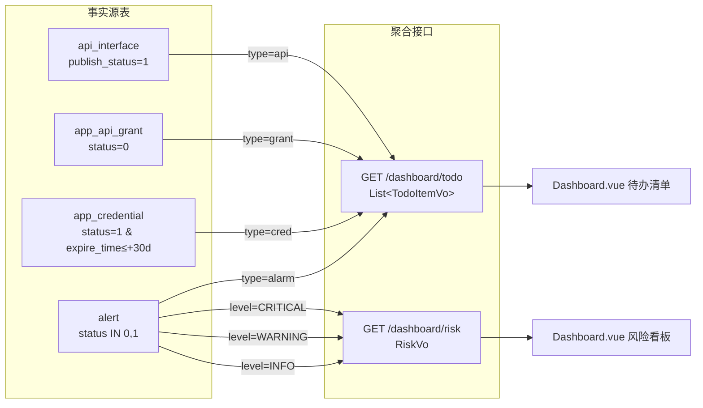

# T06 · 概览聚合（待办 / 风险）契约与偏差记录

> **背景**：概览页 `/dashboard` 的「待办事项 + 风险提示」是 PRD 的 P0（`docs/PRD-APIM重新设计.md:244–253`），但一直未闭环 —— 后端**没有对应接口**，前端靠逐域拉列表自行计数（`views/dashboard/Dashboard.vue`），且出现"把 KPI 当待办、读不存在字段"的问题。`docs/T05-前端实施计划.md:424` 曾把它标为"需确认"。
>
> **本次（T06）**：team-lead 冻结契约 —— 新增 `GET /api/dashboard/todo` 与 `GET /api/dashboard/risk` 两个聚合端点。**后端实现**：eng-t03b（任务 #26·T06-A）；**前端消费**：software-engineer-5（任务 #27·T06-B）。**本文件为权威契约快照 + 三处必须留痕的偏差记录。**
>
> **本文件只读留档**：不改任何代码，不改 `docs/sql/seed-perm-alignment.sql`。

---

## 1. 契约（已冻结）

### 1.1 端点总览

| 端点 | 方法 | 响应 | `@RequirePerm` |
|---|---|---|---|
| `/api/dashboard/todo` | GET | `Result<List<TodoItemVo>>` | **不加**（见 §2.1） |
| `/api/dashboard/risk` | GET | `Result<RiskVo>` | **不加** |

> 与既有 5 个 `/dashboard/screen/*`（`DashboardController`：overview/trend/app-rank/interface-rank/recent-events）保持一致的**无权限注解**风格。

### 1.2 `GET /api/dashboard/todo` → `Result<List<TodoItemVo>>`

`TodoItemVo` 字段：

| 字段 | 类型 | 语义 |
|---|---|---|
| `type` | String | 待办类型键：`api` / `grant` / `cred` / `alarm` |
| `label` | String | 展示文案（如「待审核接口」） |
| `count` | long | 该类型待办数量（SQL 聚合计数） |
| `desc` | String | 补充描述（可空） |
| `route` | String | 点击跳转的前端路由 |

**4 项、顺序固定**：

| 顺序 | type | label | count 条件（事实源） | route |
|---|---|---|---|---|
| 1 | `api` | 待审核接口 | `api_interface.publish_status = 1` | `/api/api-list` |
| 2 | `grant` | 待审批授权 | `app_api_grant.status = 0` | `/perm/perm-matrix` |
| 3 | `cred` | 密钥即将过期 | `app_credential.status = 1 AND expire_time ∈ (NOW(), NOW()+INTERVAL 30 DAY]` | `/app` |
| 4 | `alarm` | 未处理告警 | `alert.status IN (0,1)` | `/mon/mon-alarm` |

> `expire_time IS NULL` = 永不过期，**不计入** `cred`。

### 1.3 `GET /api/dashboard/risk` → `Result<RiskVo>`

`RiskVo = { high, mid, low }`，来源为 `alert.level`（**String**）在 `alert.status IN (0,1)` 下的分组计数：

| 字段 | 来源 |
|---|---|
| `high` | `COUNT(* WHERE level = 'CRITICAL')` |
| `mid` | `COUNT(* WHERE level = 'WARNING')` |
| `low` | `COUNT(* WHERE level = 'INFO')` |

> 恒等式：`high + mid + low = COUNT(alert WHERE status IN (0,1))`（未处理告警总数）。

### 1.4 状态枚举权威表（数据源）

| 实体.字段 | 值域 | 备注 |
|---|---|---|
| `api_interface.publish_status` | 0草稿 / 1待审核 / 2已发布 / 3已弃用 / 4已下线 | `sys_dict.api_status` |
| `app_api_grant.status` | 0待审批 / 1已生效 / 2已过期 / 3已撤销 / 4已驳回 | `sys_dict.grant_status` |
| `app_credential.status` | 1启用中 / 2已停用 / 3已吊销 / 4已过期 | `sys_dict.cred_status`；`expire_time` NULL=永不过期 |
| `alert.status` | 0未读 / 1已读 / 2已处理 / 3已忽略 | ⚠️ **处理态，非启停态** |
| `alert.level` | `INFO` / `WARNING` / `CRITICAL` | ⚠️ **String**，与 `alarm_level` 字典不一致，见偏差 2 |

### 1.5 数据源 → 接口映射（Mermaid）

---

## 2. 设计决策

### 2.1 为何两个端点都不加 `@RequirePerm`
服务端 `PermissionInterceptor` 为**精确集合匹配、无超管豁免**：给接口加 `@RequirePerm("X")` 而 `X` 未写入 `sys_menu` + 未授权，则**所有角色（含 admin）恒定 403**。本轮回溯修复的 P0 缺陷（`docs/T05-权限点契约对齐方案.md`）正是这个坑。因此概览聚合接口**刻意不加权限注解**，与既有 `/dashboard/screen/*` 一致：登录即可访问，页内重定向目标由前端按角色权限隐藏（PRD §关键业务规则③）。

### 2.2 为何用 SQL 聚合计数而非 Java 侧过滤
PRD 硬约束（`PRD:252`「指标卡数值必须走预聚合统计表，禁止直查 `api_call_log`」、`PRD:776`）：概览聚合必须**在 DB 侧完成计数**，不得把整表捞到 Java 再 `filter().size()`。本次 4 项待办均为对**业务维度表**（`api_interface`/`app_api_grant`/`app_credential`/`alert`）的 `COUNT(*)` 聚合，不涉及 `api_call_log`，天然满足约束。

### 2.3 为何 `cred` 直查 `app_credential` 而非从 `alert` 的 `KEY_EXPIRE` 告警反推
`app_credential.expire_time` 是**事实源**（密钥到底何时过期）；`alert` 里的 `KEY_EXPIRE` 是**衍生告警**，其存在与否取决于告警任务是否按计划跑过。若从告警反推，一旦告警任务停摆，待办会"消失"（漏报）。故选事实源直查，保证概览待办**不依赖告警链路健康度**。

---

## 3. 概览页缺陷清单 + 三处偏差记录（重点）

> **概览页真实缺陷清单（共 5 条，本轮修复范围）**：
> 1. **待办清单语义降级** —— 把「应用总数 / 接口总数 / 授权总数」（资源总数 / KPI）当待办渲染（`Dashboard.vue:91–93`）。
> 2. **「密钥即将过期」待办项缺失** —— 是 4 项真实待办里被漏掉的那一类。
> 3. **风险三档数据源不是一条严重度轴** —— `high = 未读告警数`、`mid = 限流次数`、`low = 安全事件数`，三个**互不相关**的概念被并列成"高/中/低危"（`Dashboard.vue:131–133`）。
> 4. **客户端计数违反 PRD** —— `loadTodos()` 逐域拉 list 再计数，违反 PRD「必须走预聚合、禁止直查」（`PRD:252/776`）。
> 5. **PRD「待审核应用」当前不可达**（见偏差 1）。
>
> ⚠️ 一度被计入"缺陷"的「`overview.securityEventCount` 字段不存在」**经复核不成立，已从缺陷清单剔除**（见偏差 3 更正）。

### 偏差 1 — PRD 要求 5 类待办含「待审核应用」：**列已存在，但领域层不可达**
- **PRD 要求**：`PRD:247` 待办 5 类 = `api 待审核接口` / `grant 待审批授权` / **`app 待审核应用`** / `cred 密钥即将过期` / `alarm 未处理告警`；`PRD:1579` 映射 `app → 待审核应用 → app-list`。
- **事实（已核对）**：
  - `sys_dict` **没有 `app_status` 字典**（种子仅 `app_type`/`visibility`/`api_status`/`grant_status`/`cred_status`/`alarm_level`）。
  - `app.status` 是**启停态**（1启用/0停用/2已过期），无「待审核」态可供现有接口使用。
  - **`schema-v2.sql` A1 已 `ADD COLUMN apps.audit_status`**（`0=待审核,1=已通过`）—— 即「待审核应用」**并非无据，DB 列已存在**。
  - **但领域层无任何实体字段映射到它**：全仓 grep 无 `auditStatus`/`audit_status`（`App` 实体无此字段）⇒ 该列**无任何 API 读写路径，当前不可达**。
- **决定**：**仍不实现**（不新增待办项、不臆造状态值、**不新增 DB 列**）。理由：前端/后端均无该字段读写路径，现在实现 = 同时补实体映射 + 应用审核流 + 前端，远超"概览页聚合"的改动面。
- **留痕结论**：概览待办 = **4 项**（api / grant / cred / alarm）。「待审核应用」记为**后续可选项**：将来若做应用审核流，`apps.audit_status` 是**可用的既有列（无需新增 DB 列）**，但仍需补实体映射 + 接口 + 前端。

### 偏差 2 — `alarm_level` 字典与实际数据不一致、且未被使用
- **字典内容**：`sys_dict.alarm_level` = `1提示 / 2警告 / 3严重`（`migrate-v2.sql:243–245`）。
- **实际数据**：`alert.level` 存**字符串** `INFO / WARNING / CRITICAL`；前端 `utils/enum.js:164` 的 `ALERT_LEVEL` 同为字符串形态（`MonAlarm.vue:101` 据此渲染）。
- **判定**：该字典**与实际数据不一致、且代码中未被使用**，属**误导性数据**（会诱导后来者按 1/2/3 解析 `alert.level`）。
- **决定**：**记为待清理项**，本次**不清理**（避免扩大改动面；清理涉字典+前端下拉+可能的下游）。风险在于歧义长期存在。
- **留痕结论**：`alert.level` 的权威形态是 **String `INFO/WARNING/CRITICAL`**；`alarm_level` 字典**废弃/待清理**，勿再引用。

### 偏差 3（已更正 → 实为"核查方法致假阴性"的案例）
- **现象 A（资源总数当待办，属实缺陷）**：`Dashboard.vue:89–94` 的 `todos` 硬编码为 `未处理告警 / 应用总数 / 接口总数 / 授权总数` —— 后三项是**资源总数**（KPI），**不是待办**；真正的待办（待审核接口/待审批授权/密钥即将过期）并未呈现。`loadTodos()`（`:118–134`）靠对 `getAppList`/`getInterfaceList`/`getPermissionList` 拉 `total` 计数拼装。（对应缺陷清单 #1）
- **现象 B（字段契约，经复核非缺陷）**：`Dashboard.vue:19` KPI「安全事件」与 `:133` 风险低危档读取 `overview.securityEventCount`。
  - **事实**：`DashboardServiceImpl.overview()`（`src/backend/.../impl/DashboardServiceImpl.java:67–73`）返回 **6 个 key**：`totalCalls` / `successRate` / `rateLimitedCount` / `blockedCount` / **`securityEventCount`** / `activeBanCount`。⇒ KPI「安全事件」卡与风险看板低危档读 `securityEventCount` **是有效取值，不存在"恒为 0"的缺陷**。（原先"字段不存在"的结论已撤销。）
- **真正风险点（保留其记录价值）**：该接口返回 `Map<String, Object>`，**没有 schema 约束** —— 键名拼写或返回值漂移时，前端 `{{ overview.xxx || 0 }}` 会**静默显示 0 而不报错**。本例中核查者因 `grep -nA30 "public Map<String, Object> overview"` **只截取了方法签名后的 30 行**（两个 `put` 落在方法体第 32–33 行、被窗口截断）而**一度误判该键缺失** —— 恰好演示了此类"**无 schema + 静默兜底**"结构下**误判与误改的风险成本**。
- **建议（后续可选项，不在本轮范围）**：为 dashboard 聚合返回定义 **VO** 替代裸 `Map`，让键名成为**编译期契约**。
- **决定**：① **待办清单**改用 `GET /dashboard/todo` 替代逐域 list 计数；② **风险三档**（尤其 `low`）改用 `GET /dashboard/risk`，**不再把 `overview.securityEventCount` 当作低危档**；③ **KPI「安全事件」卡不变**——继续取 `overview.securityEventCount`（当日口径，当前可用），本轮不得改动其数据来源（见 §4 item 6）。

---

## 4. 验证判据（可执行验收）

1. **待办项数固定且有序**：`GET /api/dashboard/todo`（admin 登录）返回 `Result<List<TodoItemVo>>`，`data.length == 4`，`data[i].type` 依次为 `api, grant, cred, alarm`。
2. **计数一致（逐项 SQL 对拍）**：对每项，接口 `count` == 对应 SQL：
   - `api`：`SELECT COUNT(*) FROM api_interface WHERE publish_status=1`
   - `grant`：`SELECT COUNT(*) FROM app_api_grant WHERE status=0`
   - `cred`：`SELECT COUNT(*) FROM app_credential WHERE status=1 AND expire_time > NOW() AND expire_time <= NOW()+INTERVAL 30 DAY`
   - `alarm`：`SELECT COUNT(*) FROM alert WHERE status IN (0,1)`
3. **风险三档自洽**：`GET /api/dashboard/risk` 返回 `{high,mid,low}`，且 `high+mid+low == SELECT COUNT(*) FROM alert WHERE status IN (0,1)`。
4. **无权限门槛**：未登录 → 401；登录（任意角色，含无相关权限者）→ 200（**不得 403**，因未加 `@RequirePerm`）。
5. **跳转目标可达**：前端点击 4 项待办分别跳 `/api/api-list`、`/perm/perm-matrix`、`/app`、`/mon/mon-alarm`；点击风险三档跳 `/mon/mon-alarm`（高）、`/mon/mon-calllog`（低）等对应页（按新契约）。
6. KPI「安全事件」**本轮不改动**，继续取 `overview.securityEventCount`（当日口径，**当前存在且可用**）。「改走 VO / 不再依赖裸 Map 键」属**后续可选项**，需**先定义 `DashboardOverviewVo` 再单独立项**；**在此之前任何人不得改动该卡的数据来源**（见偏差 3）。

---

## 5. 影响面与后续

- **后端**：`DashboardController` 新增 `todo`/`risk` 两端点 + 对应 service（eng-t03b / T06-A）。**不加 `@RequirePerm`**，故**无需**新增权限点、无需动 `sys_menu`/`sys_role_menu`。
- **前端**：`Dashboard.vue` 的 `todos`/`loadTodos()`/风险三档改用新契约（software-engineer-5 / T06-B）；`api/modules.js:182/186` 已有 `getDashboardTodo`/`getDashboardRisk` 封装。
- **待清理项 / 后续可选项（本轮不做）**：① `sys_dict.alarm_level` 误导性字典（偏差 2，建议清理或修正为 `INFO/WARNING/CRITICAL` 值域）；② `app.audit_status` 列当前**无实体映射**（偏差 1）—— 将来做应用审核流时启用（**无需新增 DB 列**），否则应清理，勿长期悬空；③ 「待审核应用」待办若确需，另行立项。
- **关联文档**：`docs/T05-前端实施计划.md`（§3.1、§8.5 已据本契约更新）。
