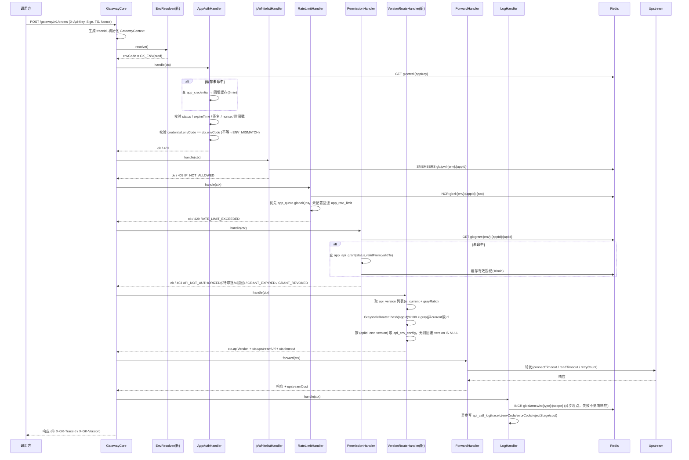
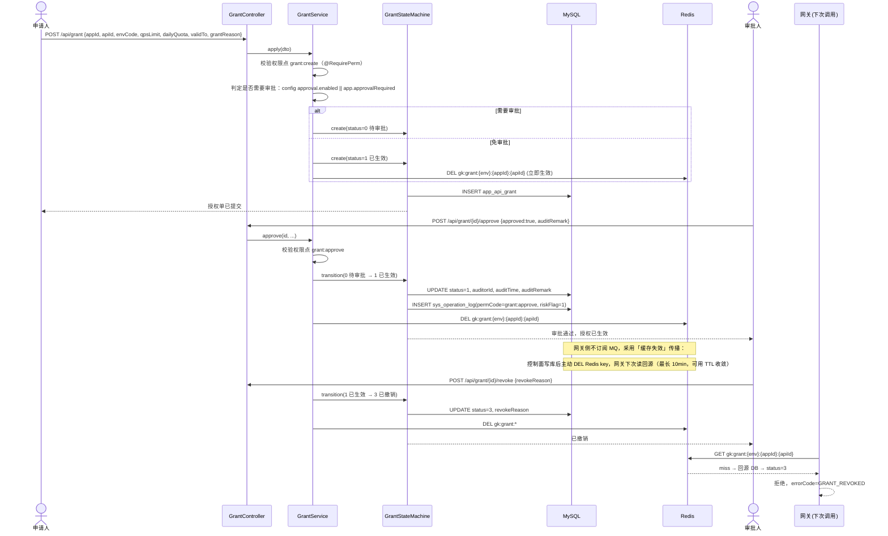
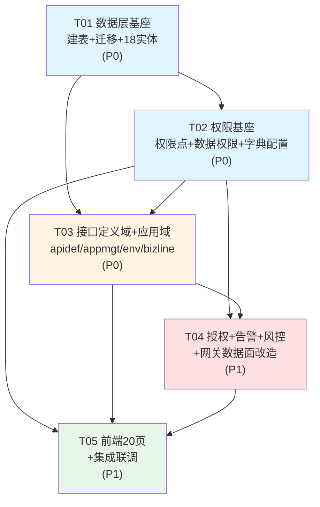

# GateKeeper → APIM 统一接口管理平台 · 架构与数据模型设计（V2 演进式重构）

> 版本：v2.0 ｜ 作者：架构师 Bob ｜ 技术约束：Java 8 + Spring Boot 2.7 + MyBatis-Plus 3.5 + MySQL 8 + Redis；前端 Vue 2.7 + Element UI + Vue Router + Vuex
>
> 输入依据：
>
> 1. 原型（目标形态）`docs/prototype/api-platform-原型.html` —— 字段名/枚举值**直接取自 MOCK 数据**（`scripts[3]` 的 28 个实体），凡属推断处均显式标注「（推断）」
> 2. 存量模型 `src/backend/src/main/resources/sql/init.sql`（416 行/18 张表）
> 3. 存量代码 `src/backend/src/main/java/com/gatekeeper/**`（含 91 个单测、网关责任链、安全检测策略、异步导出中心）
>
> 配套产物：`docs/sql/schema-v2.sql`（增量 DDL）、`docs/sql/migrate-v2.sql`（幂等迁移）


---

## 0. 一句话结论

**不推翻重写。** 存量 18 张表一张不删、网关责任链一个不动、91 个单测一个不改；用「**新建 18 张表承载原型新能力 + 10 张存量表加列增强 + 9 个新业务域包**」的方式，把 GateKeeper 演进为 APIM。存量数据与代码资产的迁移风险被限制在「加列」与「新增」两个方向上。

---

## 1. 演进策略总纲：保留 / 改造 / 新建 三类边界


### 1.1 🟢 保留（Preserve）—— 一行代码都不动，是本项目最硬的资产

| 资产 | 位置 | 为什么保留 |
| ------------------------ | ------------------------------------------------------------------------------ | ----------------------------------------------------------------------------------------------------------------------------- |
| 网关责任链 | `gateway/GatewayCore.java` + `gateway/handler/*` | AppAuth → IpWhitelist → RateLimit → Permission → AbnormalParamCheck → … → Log 的编排已稳定，91 个单测覆盖。V2 只做「**链上插一个新 Handler**」，不改编排器 |
| 安全检测策略 | `security/SecurityDetectionService` + 5 个 Detector | 薄门面 + 策略模式结构良好。V2 新增的 `block_rule` 只复用其产出（`security_event`），不替换它 |
| Redis fail-open 降级 | 各 Handler 内 + `job/RedisHealthMonitor` | fail-open 与 30s 探活是正确性保障，V2 新增的 Redis 用法必须沿用同一套降级语义 |
| 异步导出中心 | `service/impl/ExportTaskServiceImpl` + `CallLogExportExecutor` | 分批 5000 流式写临时 CSV → 原子改名，百万级可用。V2 的审计日志导出**直接复用同一个 Executor**，只换 Query |
| 有界线程池 + 背压 | `config/AsyncConfig`（CallerRunsPolicy） | V2 的告警通知、配额统计全部复用该线程池，不自建 |
| 启动密钥自检 | `config/SecurityStartupCheck` | 保留，并把 `sys_config` 中的安全项纳入自检范围 |
| 日志保留 | `job/LogRetentionJob` | 保留，改为读 `sys_config` 的 `call.log.hot.days` 而非硬编码 |
| `api_call_log` 组合索引 | 5 个（time/app_time/iface_time/ip_time/status_time） | 已针对写放大优化过。V2 **只新增 2 个索引**，不新增单列索引 |
| 加解密体系 | `crypto/*`、`api_encryption_config`、`app_encryption_config`、`EncryptionHandler` | 原型未覆盖该能力，但它是存量差异化资产，原样保留 |
| Docker Compose/Knife4j | 根目录 + `config/Knife4jConfig` | 保留，Knife4j 自动收录新增 Controller |


### 1.2 🟡 改造（Evolve）—— 加列 / 加分支 / 加 Handler，不改契约

| 对象 | 改造内容 | 兼容手段 |
| ----------------------- | -------------------------------------------------------------------------------------------------------------------- | ------------------------------------------------------------------------------------------ |
| `app` | 加 `app_code/line_id/app_type/env_scope/contact_*/approval_required/audit_status` | 存量 `app_key/app_secret/status` 全部保留 |
| `api_interface` | 加 `api_code/line_id/visibility/auth_required/publish_status/current_version/sla/tags/transport_security/grant_count` | 存量 `status`（网关开关）与新增 `publish_status`（发布生命周期）**并存**，放行条件 = `status=1 AND publish_status=2` |
| `api_group` | 加 `group_code/line_id/owner_*/api_count/status` | 存量树形 `parent_id` 保留 |
| `api_call_log` | 加 `trace_id/env_code/app_key/error_code/reject_stage/auth_cost/upstream_cost/api_version` | 存量字段不动；新增 2 个组合索引 |
| `ip_ban` | 扩展为「IP + 应用」双 scope 统一封禁名单（加 `scope/target/env_code/reason_code/block_times/ttl_seconds/unblock_*`） | `IpBanCheckHandler`/`IpBanService`/`SecurityController` 继续可用，只是多了 scope 维度 |
| `alert` | 加 `rule_id/rule_name/alarm_type/alarm_level/scope_desc/trigger_value/env_code/handler_name/notify_status` | 不新建 `alarm_record` 表，`AlertService` 与 `RedisHealthMonitor` 零改动 |
| `sys_user`/`sys_role` | 加 `emp_no/dept/line_id` 与 `role_type/data_scope/user_count` | 存量账号/角色全部保留 |
| `sys_operation_log` | 加 `perm_code/risk_flag/object_desc/change_content/result/fail_reason` | 不新建 `audit_log` 表，`OperationLogAspect` 只增加赋值 |
| 网关 `AppAuthHandler` | 改为「按 app_key 查 `app_credential` → 拿 app_id」，再校验 env/status/expire | `app.app_key` 保留为冗余列，回滚时改回一行代码 |
| 网关 `RateLimitHandler` | 优先读 `app_quota`（按 env），未配置时回退 `app_rate_limit` | `app_rate_limit` 保留为降级源 |
| 网关 `PermissionHandler` | 改读 `app_api_grant`（含 env + 状态机 + 有效期） | `app_api_permission` 保留为回滚快照，迁移后不再写入 |
| 网关责任链 | **新增** `VersionRouteHandler`（灰度分流），插在 Permission 之后、Forward 之前 | `GatewayCore` 编排器不改，只在链表中插入一项 |
| `JwtAuthInterceptor` | 从「只认证不授权」升级为「认证 + 权限点校验」 | 见 §4.5；拦截器接口不变 |

### 1.3 🔵 新建（Build）—— 18 张表 + 9 个域包 + 20 个前端页面

| 域 | 新建表 | 职责 |
| ---- | ----------------------------------------------------------- | ------------------------------------------ |
| 组织 | `biz_line`、`env` | 业务线与环境两个一级维度（环境是贯穿全局的横切维度） |
| 权限 | `sys_menu`、`sys_role_menu`、`sys_role_datascope` | 权限点树、角色授权、数据权限范围 |
| 接口定义 | `api_param`、`api_version`、`api_env_config`、`api_change_log` | 参数/版本/环境配置/变更历史，围绕 `api_interface` 展开 |
| 应用 | `app_credential`、`app_quota` | 多密钥 + 轮换；按环境配额 |
| 授权 | `app_api_grant` | 带审批流、有效期、环境、配额的授权（替代 `app_api_permission`） |
| 告警 | `alarm_rule`、`notify_channel` | 告警规则与通知渠道（`alert` 表复用为告警记录） |
| 系统 | `sys_config`、`sys_dict`、`sys_dict_item` | 参数配置与数据字典（均上 Redis 缓存） |
| 风控 | `block_rule` | 动态封禁规则（与 `security_rule` 的「检测」职责分离） |

---


## 2. 目标架构图（控制面 / 数据面分离）

```
┌────────────────────────────────────────────────────────────────────────────────┐
│                        控制面 Control Plane · 管理后台                           │
│                    Spring Boot 2.7 · context-path=/api · JWT 鉴权               │
├───────────┬───────────┬───────────┬───────────┬───────────┬────────────────────┤
│  概览      │  应用管理   │  接口管理   │  权限管理   │  系统设置   │  监控与审计        │
│ dashboard │ app        │ apidef     │ grant      │ env        │ log                │
│           │ credential │  ·param    │  ·审批流    │ bizline    │ alarm (+alert)     │
│           │ quota      │  ·version  │ role/menu  │ dict       │ block(+ip_ban)     │
│           │ ipwhitelist│  ·envcfg   │ datascope  │ config     │                    │
│           │            │  ·changelog│ audit      │ notify     │                    │
│           │            │            │            │ security   │                    │
└───────────┴───────────┴───────────┴───────────┴───────────┴────────────────────┘
      │ 写操作（同步落库）                             │ 读多写少（Cache-Aside）
      ▼                                              ▼
┌───────────────────────────────┐        ┌──────────────────────────────────────┐
│        MySQL 8  (主数据)        │        │            Redis (运行时)             │
│  存量 18 张（保留+增强）         │        │  gk:cfg:{key}        参数配置         │
│  新增 18 张（原型新能力）         │◀──────▶│  gk:dict:{code}      数据字典         │
│  回滚快照：app_api_permission,  │ 预热/  │  gk:perm:{userId}    用户权限点集合    │
│            app_rate_limit      │ 失效   │  gk:grant:{env}:{app} 授权快照         │
└───────────────────────────────┘        │  gk:rl:{env}:{app}    限流滑窗         │
      │ ① 定时/事件刷新配置                 │  gk:quota:{env}:{app} 日/月配额计数    │
      │ ② 异步导出（复用 ExportTaskExecutor）│  gk:alarm:win:{rule}  告警指标滑窗     │
      ▼                                  │  gk:alarm:silence:{}  静默期           │
┌────────────────────────────────────────────────────────────────────────────┐   │
│                    数据面 Data Plane · 网关（按环境独立部署实例）               │   │
│              GatewayCore 责任链（编排器不改，仅链上插入 VersionRoute）          │   │
│  AppAuth ─▶ IpWhitelist ─▶ RateLimit ─▶ Permission ─▶ 【VersionRoute 新增】   │   │
│        ─▶ AbnormalParamCheck ─▶ IpBanCheck ─▶ Encryption ─▶ Forward ─▶ Log    │   │
│                                                                              │   │
│  环境来源：启动参数 GK_ENV（默认 prod），运行时所有 key/查询强制带 env 前缀 ─────┘   │
└────────────────────────────────────────────────────────────────────────────┘   │
      │ 转发（按 api_id + env + version 取 upstream）      │ 异步埋点（不阻塞）    │
      ▼                                                   ▼                     │
  Upstream Service                        Redis 计数器 ◀──────────────────────────┘
                                                 │
                                                 ▼
                                     AlarmEvaluateJob → alert + 通知渠道
```

**分工原则（写进团队共识）：**

| | 控制面 | 数据面 |
| ----- | ----------------------------- | --------------------------------- |
| 关注 | 元数据增删改查、审批、配置 | 单次请求的鉴权/限流/路由/转发 |
| 数据源 | 直连 MySQL | **只**读 Redis + 本地缓存，**不**直连 MySQL |
| 可用性要求 | 可短暂不可用 | 必须高可用，Redis 挂了要 fail-open |
| 变更传播 | 写库 → 主动删 Redis key → 网关下次读时回源 | 本地 Caffeine 30s TTL 兜底 |

---

## 3. 分层设计：后端包结构

### 3.1 决策：新增域包，存量代码**本期不搬迁**

现有包是 `com.gatekeeper.{controller,service,service.impl,mapper,entity,dto}` 平铺结构。一次性按域搬迁全部存量代码 = 推翻重写，会让 91 个单测大面积失联。

**采用策略：**

- **本期**：新增 9 个业务域包，每个域包内部自带 `controller/service/impl/mapper/entity/dto`（自包含）。存量代码原位不动，新域通过「注入存量 Service」协作。
- **下期（V2.1）**：按域逐个搬迁存量代码（一次一个域、单测随迁），清单见 §9.2。


### 3.2 目标包结构（★ = 本期新建）

```
com.gatekeeper
├── common/                    Result, PageResult                          （保留）
├── config/                    AsyncConfig, JwtAuthInterceptor, WebConfig…  （保留）
│   ├── ★ DataScopeConfig          数据权限拦截器注册
│   ├── ★ PermissionInterceptorConfig  权限点拦截器注册
│   └── ★ DictCacheConfig          字典/配置缓存预热
├── annotation/                ★ @RequirePerm（权限点）、★ @DataScopeIgnore（跳过数据权限）
├── aspect/                    OperationLogAspect（保留）
│   └── ★ PermCheckAspect          权限点校验切面
├── crypto/                    CryptoService（保留）
├── security/                  SecurityDetectionService + 5 Detector（保留，不动）
├── gateway/
│   ├── GatewayCore.java                     （保留）
│   ├── dto/GatewayContext.java              （保留 + 加 envCode/version/traceId 字段）
│   ├── handler/                             （保留全部）
│   │   └── ★ VersionRouteHandler            灰度分流
│   └── ★ router/GrayscaleRouter             灰度算法（稳定哈希）
│   └── ★ EnvResolver                        环境解析（GK_ENV + 凭证 env 校验）
├── job/                       LogRetentionJob, RedisHealthMonitor（保留）
│   ├── ★ GrantExpireJob        授权过期批量置 2
│   ├── ★ AlarmEvaluateJob      告警评估（实时型 10s / 离线型 5min）
│   └── ★ QuotaResetJob         日/月配额计数重置
├── util/                      （保留）
├── ★ bizline/                 业务线：controller / service / impl / mapper / entity / dto
├── ★ env/                     环境：同上
├── ★ apidef/                  接口定义域：接口增强 + 参数 + 版本 + 环境配置 + 变更历史
├── ★ appmgt/                  应用域：应用增强 + 凭证 + 配额 + IP白名单
├── ★ grant/                   授权域：授权 + 审批流状态机
├── ★ alarm/                   告警域：告警规则 + 告警记录(alert) + 通知渠道
├── ★ datascope/               数据权限：DataScopeHandler + 范围解析
├── ★ sysconf/                 字典 + 参数配置
├── ★ block/                   封禁规则 + 封禁名单(ip_ban 增强)
├── ★ system/                  用户 + 角色 + 菜单权限点 + 操作审计
├── controller/                ← 存量 12 个 Controller（本期不动，V2.1 按域搬迁）
├── service/ + service/impl/   ← 存量 Service（本期不动）
├── mapper/                    ← 存量 Mapper（本期不动）
└── entity/ + dto/             ← 存量实体（本期不动；仅新增列的字段需要同步 getter/setter）
```


### 3.3 数据模型类图（关键域）

```mermaid
classDiagram
    %% ============ 组织维度 ============
    class BizLine {
        +Long id
        +String lineCode
        +String lineName
        +String ownerName
        +Integer memberCount
        +Integer status
    }
    class Env {
        +Long id
        +String envCode
        +String envName
        +String gatewayUrl
        +Integer sortOrder
        +Integer status
    }

    %% ============ 接口定义域 ============
    class ApiInterface {
        +Long id
        +String apiCode
        +String interfacePath
        +String requestMethod
        +Long groupId
        +Long lineId
        +Integer visibility
        +Integer authRequired
        +Integer status
        +Integer publishStatus
        +String currentVersion
        +String sla
        +String tags
        +String transportSecurity
    }
    class ApiParam {
        +Long id
        +Long apiId
        +Integer paramType
        +Long parentId
        +String fieldName
        +String fieldType
        +Integer required
        +Integer sensitive
        +String encryptRule
    }
    class ApiVersion {
        +Long id
        +Long apiId
        +String version
        +Integer status
        +Integer isCurrent
        +Integer grayRatio
        +Date offlinePlanTime
    }
    class ApiEnvConfig {
        +Long id
        +Long apiId
        +String envCode
        +String version
        +String upstreamUrl
        +Integer connectTimeout
        +Integer readTimeout
        +Integer configStatus
    }
    class ApiChangeLog {
        +Long id
        +Long apiId
        +String changeType
        +String fieldName
        +String oldValue
        +String newValue
        +String operatorName
    }

    %% ============ 应用域 ============
    class App {
        +Long id
        +String appCode
        +String appName
        +Long lineId
        +Integer appType
        +String envScope
        +Integer status
        +Integer auditStatus
        +Integer approvalRequired
    }
    class AppCredential {
        +Long id
        +Long appId
        +String appKey
        +String appSecret
        +String secretMask
        +String envCode
        +Integer status
        +Date expireTime
        +Integer rotateFlag
    }
    class AppQuota {
        +Long id
        +Long appId
        +String envCode
        +Integer globalQps
        +Long dailyQuota
        +Long monthlyQuota
        +Integer concurrency
    }
    class AppIpWhitelist {
        +Long id
        +Long appId
        +String ipCidr
        +String envCode
    }

    %% ============ 授权域 ============
    class AppApiGrant {
        +Long id
        +Long appId
        +Long apiId
        +String envCode
        +Integer qpsLimit
        +Long dailyQuota
        +Integer status
        +Date validFrom
        +Date validTo
        +String applicantName
        +String auditorName
    }

    %% ============ 权限域 ============
    class SysUser {
        +Long id
        +String username
        +String realName
        +String empNo
        +String dept
        +Long lineId
        +Integer status
    }
    class SysRole {
        +Long id
        +String roleCode
        +String roleName
        +Integer roleType
        +String dataScope
    }
    class SysMenu {
        +Long id
        +Long pid
        +String name
        +Integer type
        +String permCode
        +String routePath
        +Integer riskFlag
    }
    class SysRoleMenu {
        +Long roleId
        +Long menuId
    }
    class SysRoleDataScope {
        +Long roleId
        +String scopeType
        +String scopeValue
    }

    %% ============ 告警域 ============
    class AlarmRule {
        +Long id
        +String ruleName
        +String alarmType
        +Integer scopeType
        +String threshold
        +Integer timeWindow
        +Integer alarmLevel
        +Integer silencePeriod
        +String channelIds
    }
    class NotifyChannel {
        +Long id
        +String channelName
        +String channelType
        +String channelConfig
        +Integer status
    }
    class Alert {
        +Long id
        +Long ruleId
        +String alarmType
        +Integer alarmLevel
        +String scopeDesc
        +String triggerValue
        +String envCode
        +Integer status
        +String handlerName
    }

    %% ============ 风控域 ============
    class BlockRule {
        +Long id
        +String scope
        +String reasonCode
        +Integer thresholdCount
        +Integer windowMinutes
        +Integer ttlSeconds
        +Integer enabled
    }
    class IpBan {
        +Long id
        +String scope
        +String target
        +String envCode
        +String reasonCode
        +Integer blockType
        +Integer ttlSeconds
        +Integer banStatus
    }

    %% ============ 系统配置域 ============
    class SysConfig {
        +Long id
        +String configKey
        +String configValue
        +String configGroup
        +Integer sensitive
        +Integer builtIn
    }
    class SysDict {
        +Long id
        +String dictCode
        +String dictName
        +Integer builtIn
    }
    class SysDictItem {
        +Long id
        +String dictCode
        +String itemValue
        +String itemLabel
    }

    %% ============ 关系 ============
    BizLine "1" --> "n" App : lineId
    BizLine "1" --> "n" ApiInterface : lineId
    BizLine "1" --> "n" SysUser : lineId
    App "1" --> "n" AppCredential : appId
    App "1" --> "n" AppQuota : appId
    App "1" --> "n" AppIpWhitelist : appId
    App "1" --> "n" AppApiGrant : appId
    Env "1" --> "n" AppCredential : envCode
    Env "1" --> "n" AppQuota : envCode
    Env "1" --> "n" AppApiGrant : envCode
    Env "1" --> "n" ApiEnvConfig : envCode
    Env "1" --> "n" IpBan : envCode
    ApiInterface "1" --> "n" ApiParam : apiId
    ApiInterface "1" --> "n" ApiVersion : apiId
    ApiInterface "1" --> "n" ApiEnvConfig : apiId
    ApiInterface "1" --> "n" ApiChangeLog : apiId
    ApiInterface "1" --> "n" AppApiGrant : apiId
    SysUser "n" --> "n" SysRole : sys_user_role
    SysRole "1" --> "n" SysRoleMenu : roleId
    SysMenu "1" --> "n" SysRoleMenu : menuId
    SysRole "1" --> "n" SysRoleDataScope : roleId
    AlarmRule "1" --> "n" Alert : ruleId
    AlarmRule "n" --> "n" NotifyChannel : channelIds
    BlockRule ..> IpBan : 命中产生
    SysDict "1" --> "n" SysDictItem : dictCode
```




### 3.4 核心调用时序

#### (a) 网关数据面完整链路（含新增的环境解析与灰度分流）



#### (b) 授权申请 → 审批 → 生效（控制面状态机）



---

## 4. 关键设计决策（每条含备选方案与选择理由）


### 4.1 D1 · 环境（env）维度如何贯穿全局

**问题**：接口配置、授权、配额、凭证、IP 白名单、封禁名单都要带环境维度；网关运行时还要按环境路由。

#### 备选方案

| 方案 | 做法 | 优点 | 缺点 |
| -- | ----------------------------- | ------------------------------------------------ | --------------------------------------------------------- |
| A | 各处加 `env_id` 外键，关联 `env(id)` | 严格范式，改名无忧 | 网关每次查询需多一次 JOIN 或二次查询；Redis key 要存 id，可读性差；`env` 表增删改影响面大 |
| B | 各处加 `env_code` 冗余（VARCHAR 32） | 网关零 JOIN；Redis key 可读（`gk:rl:prod:20001`）；SQL 直观 | `env_code` 需保证不可变，否则冗余不一致 |
| C | 不引入 env 表，用配置枚举 | 最省事 | 无法在控制台增删改环境（原型明确有「环境与网关」页面） |

#### ✅ 选择：**B（env_code 冗余）+ env 表作为主数据 + env_code 创建后不可变**

**理由**：

1. **env 是低基数、低频变更、天然编码化的维度**（dev/test/pre/prod 四条），code 本身就是稳定的业务主键，"改名"场景几乎不存在；而业务线会新增/合并/改名，所以用 `line_id` 外键（B 与 A 按维度特性分别取用，不搞一刀切）。
2. **数据面收益最大**：网关 Redis key 直接拼 `env_code`，可读、可排查（`redis-cli` 里一眼看懂）；查询 `app_quota`/`app_api_grant`/`api_env_config` 时 `WHERE app_id=? AND env_code='prod'` 命中唯一索引，零 JOIN。
3. **一致性由约束而非同步保证**：`env` 表的 `env_code` 在 Service 层设「创建后不可修改」（更新接口只更新 `env_name/gateway_url/sort_order/status`），从根上消除冗余不一致。**这是选择 B 的前提，必须在实现时强制。**

**网关运行时按环境路由（三种候选）**：

| 候选 | 做法 | 结论 |
| -- | --------------------------------------------------- | ----------------------- |
| a | 每个环境部署独立网关实例（各自连自己的 DB/Redis），env 由启动参数 `GK_ENV` 注入 | ✅ **推荐** |
| b | 单实例，env 由请求 Header `X-GK-Env` 决定 | ❌ 客户端可伪造，等于把环境隔离权交给调用方 |
| c | 单实例，env 由 Host/域名区分 | ⚠️ 可行但增加网关路由复杂度，且本地联调困难 |

**最终方案 = a + 凭证二次校验**：

- 网关启动时读取 `gk.env`（默认 `prod`）作为**部署态环境**，注入 `EnvResolver`（单例）。
- 所有运行时行为强制带 env：`gk:rl:{env}:{appId}`、`gk:grant:{env}:{appId}:{apiId}`、`api_env_config` 查询、`ip_ban` 查询。
- **凭证携带 `env_code`：若 `credential.env_code ≠ GK_ENV` 直接拒绝 `ENV_MISMATCH`**（防「生产密钥拿去打测试」或反之）。
- `app.env_scope` 用于**控制面校验**：给应用配置配额/白名单/授权时，环境必须在 `env_scope` 内，防止误配。

---


### 4.2 D2 · 接口版本与灰度（gray_ratio 在数据面如何实现）

**原型事实**：`api_version` 有 `version/status/isCurrent/grayRatio/deprecateTime/offlinePlanTime`；`api_env_config` 有 `apiId/envCode/upstreamUrl/timeouts/retryCount/mockEnabled`（**没有 version 字段**）。

#### 灰度算法候选

| 候选 | 做法 | 优点 | 缺点 |
| -- | ---------------------------------------------- | ------------------- | --------------------------- |
| a | 随机：`Random.nextInt(100) < grayRatio` | 严格按比例 | 同一应用请求在 v1/v2 间跳变，状态不一致、难排查 |
| b | 按 `appId` 稳定哈希：`hash(appId) % 100 < grayRatio` | 同一应用恒定命中，可灰度指定应用白名单 | 比例受 appId 分布影响（应用数少时偏差大） |
| c | 按 `traceId`/请求 ID 哈希 | 分布最均匀 | 同一调用方跳变，同 a |
| d | 显式白名单：只有配置的应用走灰度 | 最可控 | 无法表达"百分比" |

#### ✅ 选择：**b（appId 稳定哈希）为主 + d（显式指定）为覆盖**

```java
// gateway/router/GrayscaleRouter.java（Java 8，无外部依赖）
public String route(GatewayContext ctx, List<ApiVersion> versions) {
    // 1) 显式版本头优先级最高（联调/回滚用）
    String forced = ctx.getHeader("X-GK-Version");
    if (StringUtils.isNotBlank(forced) && hasVersion(versions, forced)) return forced;

    ApiVersion current = currentOf(versions);      // is_current = 1
    ApiVersion gray    = grayOf(versions);         // is_current = 0 且 status = 1
    if (gray == null || gray.getGrayRatio() <= 0) return current.getVersion();
    if (gray.getGrayRatio() >= 100)                return gray.getVersion();

    // 2) 灰度白名单（app_gray_whitelist 可后续加，本期用 appId 哈希）
    int bucket = Math.abs(Hashing.murmur3_32().hashString(ctx.getAppId(), UTF_8).asInt()) % 100;
    return bucket < gray.getGrayRatio() ? gray.getVersion() : current.getVersion();
}
```

**实现位置**：新增 `gateway/handler/VersionRouteHandler`，插在 `PermissionHandler` 之后、`ForwardHandler` 之前（授权已确认，才有意义谈版本）。`GatewayCore` 编排器不改。

**版本 → 上游**：`api_env_config` 增加可空的 `version` 列（**推断**，`schema-v2.sql` 已标注）。取上游时：

```sql
SELECT * FROM api_env_config
WHERE api_id=? AND env_code=? AND (version=? OR version IS NULL)
ORDER BY version DESC LIMIT 1;   -- version 非空优先
```

无 version 级配置时回退到「该环境通用配置」，保证存量接口零配置可用。

**运行时读法（性能）**：`api_version` + `api_env_config` 数据量极小（千级），用 **Caffeine 本地缓存（30s 刷新）+ Redis 发布变更版本号** 双保险；Redis 不可用时本地缓存继续服务（fail-open）。

**为什么不用 Spring Cloud Gateway/Nacos 权重路由**：会引入 Spring Cloud 依赖栈，与 Spring Boot 2.7 + 自研责任链的现状冲突，且改造面远超"演进"边界。

---


### 4.3 D3 · 授权审批流状态机与网关校验的关系

**原型事实**：`grant_status` 字典 = `0待审批/1已生效/2已过期/3已撤销/4已驳回`；`grants` 有 `validFrom/validTo/applicantName/auditorName/auditTime/grantReason`。

#### 状态机

```
                  ┌──────────────────────────────────────────┐
                  │                                          │
   [创建申请] ──▶ 0 待审批 ──approve──▶ 1 已生效 ──revoke──▶ 3 已撤销
                  │                        │                     ▲
                  └──reject──▶ 4 已驳回     └──expire(validTo<now)│
                       │                        │                │
                       └──resubmit(重新提交)─────┘                │
                                    └──▶ 2 已过期 ──renew(续期，重新走审批)──┘

  免审批路径：[创建申请] ─(approval.enabled=false 且 app.approvalRequired=0)─▶ 1 已生效
```

| 迁移 | 触发 | 权限点 | 副作用 |
| -------------- | ------------------------------------ | --------------- | ------------------------------- |
| create → 0/1 | `GrantService.apply` | `grant:create` | 写 `sys_operation_log` |
| 0 → 1 | `approve(approved=true)` | `grant:approve` | **DEL Redis 授权缓存**，写审计 |
| 0 → 4 | `approve(approved=false)` | `grant:approve` | 写审计 |
| 1 → 3 | `revoke` | `grant:revoke` | **DEL Redis 缓存**，riskFlag=1，写审计 |
| 1 → 2 | `GrantExpireJob`（每天 02:00，批量 UPDATE） | 系统 | 仅更新列表展示/统计 |
| 2/4 → 0 | `resubmit` | `grant:create` | 重新进入审批 |
| 2 → 1 | `renew`（改 validTo 后重新审批） | `grant:approve` | DEL Redis 缓存 |

#### 网关校验规则（**核心结论：审批中的授权一律不生效**）

| 状态 | 网关行为 | errorCode |
| ----------------------------------- | ---- | -------------------- |
| 0 待审批 | ❌ 拒绝 | `API_NOT_AUTHORIZED` |
| 4 已驳回 | ❌ 拒绝 | `API_NOT_AUTHORIZED` |
| 3 已撤销 | ❌ 拒绝 | `GRANT_REVOKED` |
| 2 已过期 | ❌ 拒绝 | `GRANT_EXPIRED` |
| 1 已生效 且 `validFrom ≤ now ≤ validTo` | ✅ 放行 | — |
| 1 已生效 但超出有效期 | ❌ 拒绝 | `GRANT_EXPIRED` |

**为什么审批中不生效**：安全默认拒绝（Default Deny）。审批中放行等于"先上车后补票"，一旦审批被驳回，已经产生的调用无法回收，对含敏感信息的接口（`user.get`）是不可接受的风险。原型中 `status=0` 的授权（财务报表系统）`usedToday=0`，与"未生效"一致。

**过期判定双保险**：

1. `GrantExpireJob` 每天批量把 `valid_to < CURDATE() AND status=1` 置为 2（供列表/统计/告警使用）；
2. **网关读取时仍做时间比较**（`validFrom <= now <= validTo`），不依赖 job —— 避免 job 延迟/失败期间放过已过期授权。

**免审批开关**：`sys_config.approval.enabled`（原型默认 `false`，MVP 关闭）+ `app.approval_required`（应用级）。两者任一为「需要审批」则进入 0 状态。这样可以把审批流作为灰度能力上线，不影响现有自动授权体验。

---


### 4.4 D4 · 数据权限（datascope）实现方式

**原型事实**：「数据权限」页 = 角色 ×（业务线多选 + 环境多选 + 接口分组多选），预览"该角色登录后可见的应用/接口"。

#### 备选方案

| 方案 | 做法 | 优点 | 缺点 |
| -- | ------------------------------------------------------------------------- | ------------------------------------------ | ------------------------------- |
| A | 自研 MyBatis Interceptor，正则改写 SQL WHERE | 完全可控 | 别名/子查询/UNION 解析极易出错，维护成本高 |
| B | Service 层条件拼装：每个查询方法手动 `wrapper.in("line_id", ids)` | 简单、可预测、易调试 | 侵入业务代码，易漏写（"忘了加过滤"= 越权） |
| C | **MyBatis-Plus 3.5 内置 `DataPermissionInterceptor`**（基于 JSQLParser 改写 AST） | 官方支持、全局生效、业务零感知、有 `@InterceptorIgnore` 逃生口 | 复杂 SQL（多表 JOIN 别名/UNION）需显式跳过 |

#### ✅ 选择：**C 为主 + B 兜底 + 复杂查询显式跳过**

**理由**：MP 3.5.x 已内置该能力（`com.baomidou.mybatisplus.extension.plugins.inner.DataPermissionInterceptor`），无需自研解析器，与现有 `MybatisPlusConfig` 天然集成；"漏写过滤"这一最大风险由全局拦截器消除。

**实现要点（Java 8/MP 3.5）**：

```java
// datascope/DataScopeHandler.java
@Component
@RequiredArgsConstructor
public class DataScopeHandler implements DataPermissionHandler {

    @Override
    public Expression getSqlSegment(Expression where, String mappedStatementId) {
        LoginUser user = UserContext.get();
        if (user == null || user.isSuperAdmin()) return where;          // 超管放行

        DataScope scope = scopeCache.get(user.getId());                 // Redis gk:ds:{userId}
        if (scope == null || scope.isEmpty()) return where;             // 未配置 = 不限

        List<Expression> conds = new ArrayList<>();
        if (!scope.getLineIds().isEmpty()) {
            conds.add(in("line_id", scope.getLineIds()));
        }
        if (!scope.getEnvCodes().isEmpty()) {
            conds.add(in("env_code", scope.getEnvCodes()));
        }
        if (!scope.getGroupIds().isEmpty()) {
            conds.add(in("group_id", scope.getGroupIds()));
        }
        Expression extra = and(conds);
        return where == null ? extra : new AndExpression(where, extra);
    }
}
```

```java
// config/DataScopeConfig 中注册（放在 MybatisPlusConfig 的插件链内）
@Bean
public DataPermissionInterceptor dataPermissionInterceptor(DataScopeHandler h) {
    return new DataPermissionInterceptor(h);
}
```

**必须跳过的场景**（用 MP 的 `@InterceptorIgnore(dataPermission = "true")` 或 ThreadLocal 开关）：

- `DashboardService` 的全平台聚合统计（概览页 KPI 不应被业务线过滤，否则"接口总数"对 BIZ_ADMIN 显示 3 个）
- `LogRetentionJob`/`CallLogExportExecutor`/`GrantExpireJob` 等后台任务（无登录上下文，必须放行 → 用 `UserContext` 判空天然放行）
- `sys_user`/`sys_role`/`sys_menu`/`sys_config`/`sys_dict` 等系统表的查询（这些表没有 `line_id` 列，拦截器会因列不存在报错 → **只对含 `line_id`/`env_code`/`group_id` 列的表生效**，通过 `mappedStatementId` 白名单控制）

**落地建议**：把「需要数据权限过滤的表」显式登记为白名单（`app/api_interface/api_group/app_api_grant/api_call_log/app_quota/app_credential`），**不在白名单内的一律不过滤**。宁可少过滤，不可误过滤或 SQL 报错。

---


### 4.5 D5 · 菜单权限点：从「硬编码白名单」升级为「权限点注解 + 角色权限表」

**现状问题（必须点明）**：

```java
// config/WebConfig.java 现状
registry.addInterceptor(jwtAuthInterceptor)
        .addPathPatterns("/**")
        .excludePathPatterns("/auth/login", "/gateway/**", "/doc.html", ...);
```

`JwtAuthInterceptor` **只做认证、不做授权**——只要拿到 JWT，任何登录用户都能调用全部管理接口（包括 `app:credential:revoke`、`grant:revoke`、`sys:security:update`）。这是当前系统最明显的权限缺口。

#### 备选方案

| 方案 | 做法 | 结论 |
| -- | ---------------------------------------------------------- | -------------------------------------------------------------------------------------- |
| A | 在 `WebConfig` 里维护 URL → 角色 的硬编码映射表 | ❌ 规则散落在配置里，每加一个接口改一次配置，且与原型 29 个细粒度权限点不匹配 |
| B | Spring Security + `@PreAuthorize` | ⚠️ 能力完备，但引入 Spring Security 会与现有 `JwtAuthInterceptor`/`SecurityStartupCheck` 冲突，改造面大 |
| C | **`@RequirePerm("app:create")` 注解 + AOP/拦截器 + Redis 权限集合** | ✅ 推荐 |

#### ✅ 选择：**C**

**实现三段式**：

**(1) 注解（新增 `annotation/RequirePerm.java`）**

```java
@Target({ElementType.METHOD, ElementType.TYPE})
@Retention(RetentionPolicy.RUNTIME)
public @interface RequirePerm {
    String value();        // 权限点编码，如 "app:credential:revoke"
    boolean risk() default false;  // 是否高危（高危强制写审计，risk_flag=1）
}
```

**(2) 权限集合加载（登录时 + 变更时失效）**

```java
// 登录成功 / 首次访问时
List<String> perms = sysRoleMenuMapper.selectPermCodesByUserId(userId);
redisTemplate.opsForValue().set("gk:perm:" + userId, String.join(",", perms), 30, MINUTES);

// 角色授权 / 菜单变更 / 用户角色变更 后
redisTemplate.delete(redisTemplate.keys("gk:perm:*"));   // 或按角色反查精确失效
```

> JWT **不携带权限**（避免 token 膨胀与权限变更滞后），只带 `uid`/`username`（现状即如此，零改动）。

**(3) 校验切面（新增 `aspect/PermCheckAspect.java`，在 `JwtAuthInterceptor` 之后执行）**

```java
@Around("@annotation(rp)")
public Object check(ProceedingJoinPoint pjp, RequirePerm rp) throws Throwable {
    LoginUser user = UserContext.get();
    if (user == null) throw new BizException(401, "未登录");
    if (user.isSuperAdmin()) return pjp.proceed();          // 超管短路（可配置）
    if (!permService.hasPerm(user.getId(), rp.value())) {
        throw new BizException(403, "无权限：" + rp.value());
    }
    return pjp.proceed();
}
```

**落地方式**：优先做成 `HandlerInterceptor`（可拿到 `HandlerMethod` 读注解，一次 `preHandle` 完成，比 AOP 更省），注册在 `WebConfig` 中、`jwtAuthInterceptor` 之后。

**(4) 前端菜单不再硬编码**

- 新增 `GET /api/auth/menus`：后端按 `sys_menu`（type=2 页面节点 + type=1 模块）+ 当前用户权限点过滤后返回树。
- 前端 `store` 存 `perms: []`，提供 `v-perm="'app:create'"` 指令控制按钮显隐（**注意：前端显隐只是体验，后端校验才是安全边界**）。

**与存量 `security/` 包的关系**：`security/` 管的是**数据面**（调用方的安全检测），本决策管的是**控制面**（后台管理员的授权），两者正交，互不干扰。

---


### 4.6 D6 · 告警评估触发方式

**原型事实**：7 条规则，覆盖 `FAIL_RATE/AUTH_FAIL/QUOTA_USAGE/AVG_LATENCY/KEY_EXPIRE/ZOMBIE_API/QPS_SURGE`，窗口从 5 分钟到 43200 分钟（30 天）不等，静默期 10~10080 分钟。

#### 备选方案

| 方案 | 做法 | 优点 | 缺点 |
| -- | --------------------------------------- | ----------- | -------------------------------------------------------- |
| A | 纯定时轮询：`@Scheduled` 每分钟聚合 `api_call_log` | 实现最简单，不侵入网关 | 实时性差（≥1min）；高频扫热表（`api_call_log` 千万级）压力大；窗口 5min 的规则延迟明显 |
| B | 纯网关内埋点：LogHandler 中自增 Redis 计数，超阈值立即触发 | 秒级发现，不查库 | 埋点逻辑浸入数据面主链路；计数维度多（app/api/接口）时 key 膨胀；Redis 挂了告警全丢 |
| C | **混合：按 alarm_type 分类，实时型埋点 + 离线型轮询** | 各取所长 | 两套实现 |

#### ✅ 选择：**C（混合）**

| 类型 | 规则 | 触发方式 | 周期 |
| ------------- | ------------------------------------------------- | --------------------------------------------------------------------------------------- | --------- |
| **实时型**（流量指标） | `FAIL_RATE`、`AUTH_FAIL`、`QPS_SURGE`、`AVG_LATENCY` | 网关 `LogHandler` 异步埋点写 Redis 滑窗（ZSET，score=时间戳），`AlarmEvaluateJob` 每 **10s** 读窗口计算 + 判阈值 | 10s |
| **离线型**（状态指标） | `QUOTA_USAGE`、`KEY_EXPIRE`、`ZOMBIE_API` | `AlarmEvaluateJob` 每 **5min**（密钥/配额）与每天 05:00（僵尸接口）扫配置表/授权表 | 5min/1d |

**理由**：

- 流量型指标（失败率、鉴权失败）本就来自网关，埋点是"顺手"的，且安全事件的价值随时间急剧衰减——10s 级发现是有意义的；
- 状态型指标（配额用了 99%、密钥 30 天后过期、接口 30 天没调用）本身就是"慢变量"，扫表完全够用，埋点反而要维护一堆计数器；
- 单一方案要么太慢（A）要么太重（B）。

**关键约束（保护数据面）**：

1. **埋点必须异步且失败静默**：`LogHandler` 中投递到 `AsyncConfig` 线程池执行，异常只打 WARN，**绝不阻断响应、绝不影响 fail-open 语义**。
2. **Redis 不可用时降级为轮询兜底**：`RedisHealthMonitor` 已具备状态翻转能力，检测到 Redis 不可用时，`AlarmEvaluateJob` 切换为「扫 `api_call_log` 近 N 分钟」模式，告警能力降级但不归零。
3. **静默期**：`gk:alarm:silence:{ruleId}:{scopeKey}` 设 TTL = `silence_period` 分钟，命中则不重复告警（防止刷屏，原型静默期最长 10080 分钟 = 7 天）。
4. **通知异步**：写 `alert` 记录与推送通知渠道解耦——先落库（保证不丢），再由 `@Async` 推送 `notify_channel`，失败重试 3 次并更新 `notify_status=2`。

---


### 4.7 D7 · 字典（dicts）与参数配置（configs）是否上缓存

#### ✅ 结论：**都上缓存**，且采用 **Cache-Aside + 主动失效**，不用 TTL 兜底

| 项 | Redis key | 结构 | 数据量 | 失效策略 |
| ---- | ----------------------- | -------------------- | ------------- | ------------------------ |
| 字典 | `gk:dict:{dictCode}` | List<DictItem>（JSON） | ~6 个字典/22 项 | 字典或字典项增删改 → `DEL` 对应 key |
| 参数配置 | `gk:config:{configKey}` | String | ~19 项 | 配置修改 → `DEL` 对应 key |

**为什么上缓存**：

- 字典在**每一次列表页渲染、每一次下拉框加载**都会读，且原型中下拉框遍布 20 个页面；
- `sys_config` 中的 `sign.*`/`gateway.*` 项是**网关每次请求都可能读**的（如 `gateway.auth.enabled`）；
- 两者都是读多写少（写操作以"天"计），是缓存的最佳场景。

**一致性处理（三段式）**：

1. **写**：`UPDATE sys_config` → 事务提交后 `redis.del(key)`（用 `TransactionSynchronizationManager.afterCommit` 注册回调，**避免事务回滚但缓存已删**）。
2. **读**：`GET` miss → 查库 → `SET`（不设 TTL 或设长 TTL 24h 作为兜底防雪崩）→ 返回。
3. **多实例**：所有实例共享同一 Redis，`DEL` 对全部实例立即生效，**不需要** pub/sub（避免引入额外复杂度和消息丢失问题）。

**降级**：Redis 不可用时直连 DB（与网关 fail-open 同一套 `RedisHealthMonitor` 思路），并在本地用 Caffeine 缓存 60s 防止 DB 被打爆。

**敏感配置**：`sensitive=1` 的配置（如 `secret.encrypt.algo`、`gateway.auth.enabled`）在接口返回时值替换为 `******`，前端仅可改不可读（原型 `sensitive` 字段即为此意）。

**启动预热**：新增 `ApplicationRunner`（`sysconf` 包），启动时全量加载 dict/config 到 Redis（`SET` 覆盖式，幂等），避免冷启动瞬时穿透。

---

## 5. 前端架构（Vue 2.7 + Element UI，不引入新框架）

### 5.1 现状盘点

```
frontend/src
├── api/index.js        axios 实例（baseURL=/api, Bearer Token, 401 跳登录）
├── api/modules.js      单文件聚合 ~50 个 API 函数
├── router/index.js     平铺 12 条路由 + beforeEach 登录守卫
├── store/index.js      Vuex
├── components/Layout.vue（硬编码菜单）
└── views/              8 个页面目录（dashboard/app/interface/permission/encryption/log/alert/security/system/screen）
```

**目标**：承接原型 6 大模块 20 个页面，且不破坏现有 12 条路由。


### 5.2 扩展方案（4 处改动，全部向后兼容）

#### (1) API 层：单文件 → 按域拆分 + 聚合再导出

```
frontend/src/api/
├── index.js        （保留，axios 实例不动）
├── modules.js      （保留，改为 re-export 聚合，现有 import 全部不破）
├── app.js          应用 / 凭证 / 配额 / IP白名单
├── apidef.js       接口 / 分组 / 参数 / 版本 / 环境配置 / 变更历史
├── grant.js        授权 + 审批
├── alarm.js        告警规则 / 告警记录 / 通知渠道
├── log.js          调用日志 / 导出（从 modules.js 迁出）
├── sys.js          用户 / 角色 / 菜单 / 审计
├── conf.js         字典 / 参数配置 / 环境 / 业务线
└── block.js        封禁规则 / 封禁名单
```

> `modules.js` 保留并做 `export * from './app'` 等聚合 —— **平滑过渡的关键**：老页面继续 `import { getAppList } from '@/api/modules'` 可用，新页面用 `import { getAppList } from '@/api/app'`。

#### (2) 路由：平铺 → 按模块分文件 + meta.perm

```
frontend/src/router/
├── index.js        （保留结构，改为 modules 聚合）
└── modules/
    ├── dashboard.js
    ├── app.js       /app/list
    ├── api.js       /api/group, /api/list
    ├── perm.js      /perm/{user,role,matrix,datascope,audit}
    ├── sys.js       /sys/{env,security,bizline,dict,alarm,notify,config,log}
    └── mon.js       /mon/{calllog,alarm,block}
```

**保留全部 12 条存量路由**（`/dashboard`、`/app`、`/interface`、`/permission`、`/encryption`、`/system`、`/log`、`/alert`、`/security/*`、`/screen`），新页面走新路径。`/interface` 与 `/api/list` 短期并存（同一组件两种入口），V2.1 再下线 `/interface`。

`meta` 增加：`{ title, perm: 'app:list', keepAlive: true }`，供守卫与菜单过滤使用。

#### (3) 菜单：硬编码 → 后端下发 + 权限过滤

- `Layout.vue` 的硬编码菜单 → 改为从 `store.state.menus` 渲染（递归组件递归 `children`）。
- 登录后 `GET /api/auth/menus` 拉取（后端已按权限过滤），存入 Vuex + `sessionStorage`（防刷新丢失）。
- **降级**：接口失败时回退到本地静态菜单（保证后端未就绪时前端仍可开发联调）。

#### (4) 权限指令 + store

```js
// directive/perm.js
Vue.directive('perm', {
  inserted(el, binding, vnode) {
    if (!vnode.context.$store.getters.hasPerm(binding.value)) el.parentNode.removeChild(el)
  }
})

// store/index.js
state: { menus: [], perms: [] },
getters: { hasPerm: state => code => state.perms.includes(code) || state.perms.includes('*') }
```

用法：`<el-button v-perm="'app:credential:revoke'">吊销</el-button>`


### 5.3 页面落地清单（20 页）

| 模块 | 页面 | 路由 | 复用现有组件 |
| ----- | ------ | ----------------- | ------------------------------------- |
| 概览 | 概览 | `/dashboard` | ✅ 改造 `views/dashboard/Index.vue` |
| 应用管理 | 应用列表 | `/app/list` | ✅ 改造 `views/app/Index.vue` |
| 接口管理 | 接口分组 | `/api/group` | ✅ 复用 `views/interface/Index.vue` 的分组树 |
| | 接口列表 | `/api/list` | ✅ 改造 `views/interface/Index.vue` |
| 权限管理 | 用户管理 | `/perm/user` | ✅ 复用 `views/system/Index.vue` 用户 Tab |
| | 角色管理 | `/perm/role` | ✅ 复用角色 Tab |
| | 接口授权总览 | `/perm/matrix` | ✅ 复用 `views/permission/Index.vue` |
| | 数据权限 | `/perm/datascope` | 🆕 |
| | 操作审计 | `/perm/audit` | ✅ 复用 `views/system/Index.vue` 审计 Tab |
| 系统设置 | 环境与网关 | `/sys/env` | 🆕 |
| | 安全策略 | `/sys/security` | ✅ 复用 `views/security/Rule.vue` |
| | 业务线管理 | `/sys/bizline` | 🆕 |
| | 字典管理 | `/sys/dict` | 🆕 |
| | 告警规则 | `/sys/alarm` | 🆕 |
| | 通知渠道 | `/sys/notify` | 🆕 |
| | 参数配置 | `/sys/config` | 🆕 |
| | 日志与审计 | `/sys/log` | ✅ 复用 `views/log/Index.vue` |
| 监控与审计 | 调用日志 | `/mon/calllog` | ✅ 复用 `views/log/Index.vue` |
| | 告警记录 | `/mon/alarm` | ✅ 改造 `views/alert/Index.vue` |
| | 封禁管理 | `/mon/block` | ✅ 复用 `views/security/Ban.vue` |

> 16/20 页可由现有组件改造复用，仅 6 页从零新建 —— 这是"演进"而非"重写"在前端侧的体现。

---

## 6. 兼容与迁移


### 6.1 存量 12 个 Controller 处置表

| # | Controller | 路径 | 处置 | 具体动作 |
| -- | ---------------------------- | ---------------- | -------------- | ----------------------------------------------------------------------------------------------------------------------------------------------------------------- |
| 1 | `AuthController` | `/auth/**` | **保留 + 扩展** | 新增 `/auth/profile`、`/auth/menus`（返回权限树 + 权限点数组）；`/auth/login` 返回体增加 `perms`、`menus` |
| 2 | `AppController` | `/app/**` | **保留 + 扩展** | 请求/响应 DTO 增加 `appCode/lineId/appType/envScope/contact*/approvalRequired`；新增子资源 `/app/{id}/credentials`（CRUD + reset + revoke）、`/app/{id}/quota`（按 env） |
| 3 | `InterfaceController` | `/interface/**` | **保留 + 扩展** | DTO 增加原型字段；新增 `/interface/{id}/params`、`/versions`、`/env-configs`、`/change-logs`、`/publish`、`/offline`；**另注册别名 `/api/**`（新 `ApiDefController`）**，两条路径指向同一 Service |
| 4 | `ApiGroupController` | `/group/**` | **保留 + 扩展** | DTO 增加 `groupCode/lineId/owner*` |
| 5 | `PermissionController` | `/permission/**` | **保留路径 + 换底层** | 对外契约不变（`/list`、`/grant`、`/batch`、`/revoke`），底层 `app_api_permission` → `app_api_grant`；新增 `/permission/{id}/approve`、`/reject`、`/renew`、`/pending` |
| 6 | `CallLogController` | `/log/**` | **保留 + 扩展** | 查询参数增加 `envCode/errorCode/rejectStage/traceId/apiVersion`；导出能力原样复用 |
| 7 | `AlertController` | `/alert/**` | **保留 + 语义对齐** | 响应增加 `ruleId/alarmType/alarmLevel/scopeDesc/triggerValue/envCode/handlerName`；`status` 语义扩展为 0待处理/1处理中/2已处理/3已忽略 |
| 8 | `SecurityController` | `/security/**` | **保留 + 扩展** | `/ip-ban` 扩展为统一封禁名单（增加 `scope/target/envCode/reasonCode/ttlSeconds`）；新增 `/security/block-rule` |
| 9 | `EncryptionConfigController` | `/encryption/**` | **保留不动** | 原型未覆盖，原样保留 |
| 10 | `DashboardController` | `/dashboard/**` | **保留 + 扩展** | 新增 `/dashboard/overview` 返回原型结构（metrics/todos/risks/topApis/topApps）；现有 `/screen/*` 保留供大屏页 |
| 11 | `GatewayController` | `/gateway/**` | **保留不动** | 数据面入口，仅 `GatewayContext` 增加字段 |
| 12 | `SystemController` | `/system/**` | **保留 + 扩展** | 新增用户/角色/审计的原型字段；新增菜单权限、数据权限、字典、配置、环境、业务线、通知渠道、告警规则（或拆到新域 Controller，`/system/**` 保留为兼容入口） |

**新增 Controller（本期）**：`EnvController`、`BizLineController`、`MenuController`、`DataScopeController`、`DictController`、`ConfigController`、`NotifyChannelController`、`AlarmRuleController`、`BlockRuleController`、`ApiDefController`（`/api/**` 别名）、`GrantController`（`/grant/**`，与 `/permission/**` 同 Service）。

### 6.2 前端 API 调用平滑过渡

| 阶段 | 动作 |
| ---------- | ------------------------------------------------------------------------- |
| 阶段 1 | 后端保证**所有存量接口响应字段只增不减**（`app/list` 多返回 `appCode/lineId/appType` 等，老前端忽略即可） |
| 阶段 2 | 前端 `api/modules.js` 拆分为按域文件 + 聚合再导出，老 `import` 路径零改动 |
| 阶段 3 | 新页面使用新路径（`/api/app/list`、`/api/grant/list`），老页面继续用老路径 |
| 阶段 4（V2.1） | 老路径标记 `@Deprecated`，前端全部切完后删除 |

**响应体格式保持不变**：`{code, data, message}`（`common/Result.java`），前端 `api/index.js` 的拦截器零改动。分页保持 `PageResult` 结构。

### 6.3 数据迁移三步走（对应 `docs/sql/*.sql`）

```
1) schema-v2.sql  —— 增量 DDL：18 新建表 + 10 张表 ALTER（幂等，用 gk_add_column/gk_add_index 守卫）
2) migrate-v2.sql —— 数据搬迁：主数据种子 + 存量回填 + 旧表→新表搬迁（全幂等）
3) 应用切换       —— 网关改读新表（app_credential / app_quota / app_api_grant）
```

**回滚预案**：`app_api_permission`、`app_rate_limit`、`app.app_key/app_secret` 全部保留且迁移脚本不删除任何数据 —— 一旦 V2 出问题，改回 `AppAuthHandler`/`RateLimitHandler`/`PermissionHandler` 的读取源即可（3 个类的行数级改动），无需回滚数据库。

### 6.4 存量枚举冲突处理（3 处，已在 DDL 注释中标注）

| 表 | 存量语义 | 原型语义 | 处理 |
| ---------------------- | ----------------- | ------------------------------------- | ---------------------------------------------------------- |
| `app.status` | 1启用/0停用/2已过期 | 0=待审核 | 新增 `audit_status`（0待审核/1已通过），`status` 保持不变 |
| `api_interface.status` | 1启用/0停用 | `api_status`: 0草稿/1待审核/2已发布/3已弃用/4已下线 | 新增 `publish_status`，网关放行 = `status=1 AND publish_status=2` |
| `alert.status` | 0未读/1已读/2已处理/3已忽略 | `handleStatus`: 0待处理/1处理中/2已处理/3已忽略 | 语义微调（0→待处理, 1→处理中），旧数据无需迁移 |

---

## 7. 数据模型总览


### 7.1 表清单与来源

| # | 表 | 来源 | 说明 |
| -- | ------------------------------------------------- | -------------------- | ------------------------ |
| 1 | `biz_line` | 🆕 原型 bizLines | 业务线 |
| 2 | `env` | 🆕 原型 envs | 环境主数据，env_code 不可变 |
| 3 | `sys_menu` | 🆕 原型 menus | 6 模块 + 28 权限点 + 20 页面节点 |
| 4 | `sys_role_menu` | 🆕 原型 rolePerms | 角色权限点 |
| 5 | `sys_role_datascope` | 🆕 原型 数据权限页 | 角色数据范围（业务线/环境/分组） |
| 6 | `api_param` | 🆕 原型 apiParams | 参数/响应/错误码，支持嵌套 |
| 7 | `api_version` | 🆕 原型 apiVersions | 版本 + 灰度比例 |
| 8 | `api_env_config` | 🆕 原型 apiEnvConfigs | 按环境（+可选版本）的上游配置 |
| 9 | `api_change_log` | 🆕 原型 apiChangeLogs | 接口变更历史 |
| 10 | `app_credential` | 🆕 原型 credentials | 多密钥 + 环境 + 轮换 |
| 11 | `app_quota` | 🆕 原型 appQuotas | 按环境配额（替代 app_rate_limit） |
| 12 | `app_api_grant` | 🆕 原型 grants | 带审批/有效期/环境的授权 |
| 13 | `alarm_rule` | 🆕 原型 alarmRules | 告警规则 |
| 14 | `notify_channel` | 🆕 原型 notifyChannels | 通知渠道 |
| 15 | `sys_config` | 🆕 原型 configs | 参数配置（19 项种子） |
| 16 | `sys_dict` | 🆕 原型 dicts | 字典（6 个） |
| 17 | `sys_dict_item` | 🆕 原型 dicts[].items | 字典项（22 项） |
| 18 | `block_rule` | 🆕 原型 blockRules | 动态封禁规则（5 条种子） |
| 19 | `app` | 🔧 ALTER | +9 列 |
| 20 | `app_ip_whitelist` | 🔧 ALTER | +env_code, +status |
| 21 | `api_group` | 🔧 ALTER | +6 列 |
| 22 | `api_interface` | 🔧 ALTER | +13 列 |
| 23 | `api_call_log` | 🔧 ALTER | +7 列 + 2 索引 |
| 24 | `ip_ban` | 🔧 ALTER | 扩展为统一封禁名单，+10 列 |
| 25 | `alert` | 🔧 ALTER | +10 列（承载 alarmRecords） |
| 26 | `sys_user` | 🔧 ALTER | +3 列 |
| 27 | `sys_role` | 🔧 ALTER | +3 列 |
| 28 | `sys_operation_log` | 🔧 ALTER | +6 列（承载 auditLogs） |
| — | `app_rate_limit` | ⏸ 保留 | 配额降级回退源 |
| — | `app_api_permission` | ⏸ 保留 | 授权回滚快照 |
| — | `api_encryption_config`/`app_encryption_config` | ⏸ 保留 | 加解密资产 |
| — | `security_rule`/`security_event` | ⏸ 保留 | 安全检测资产 |
| — | `export_task`/`sys_user_role` | ⏸ 保留 | — |

> 注：`dashboard`（概览）与原型中的 `blocklists` 不新建表 —— 概览是聚合查询，封禁名单由 `ip_ban` 扩展承担。

### 7.2 字段映射备注（原型名 → 库表列）

| 原型字段 | 库表列 | 备注 |
| --------------------------- | ------------------------------------------ | -------------------------------- |
| `apis.apiId` | `api_interface.id` | 实体主键 |
| `callLogs.apiId` | `api_call_log.interface_id` | **同义，不新增冗余列** |
| `ipWhitelists.ipValue` | `app_ip_whitelist.ip_cidr` | **同义，不新增冗余列** |
| `users.mobile` | `sys_user.phone` | **同义，不新增冗余列** |
| `grants.usedToday` | Redis `gk:grant:used:{yyyyMMdd}:{grantId}` | **不落库**，避免热行写放大 |
| `apps.envScope`（数组） | `app.env_scope`（逗号分隔串） | MySQL 无数组类型；长度 ≤ 64 |
| `apis.tags`（数组） | `api_interface.tags`（逗号分隔串） | 同上 |
| `credentials.secretMask` | `app_credential.secret_mask` | 展示用掩码，真实 secret 加密存 `app_secret` |
| `blocklists.blockBy` | `ip_ban.created_by` | 0=系统自动，其他=用户ID |
| `blocklists.expireTime` | `ip_ban.ban_end_time` | **同义** |
| `blocklists.reasonDetail` | `ip_ban.ban_reason` | **同义** |
| `alarmRecords.handleStatus` | `alert.status` | 语义扩展对齐 |
| `auditLogs.*` | `sys_operation_log.*` | **不新建表**，加列承载 |

---

## 8. Part B：任务分解

### 8.1 Required Packages（全部沿用现有技术栈，不新增框架）

后端（Java 8/Spring Boot 2.7，以下版本与现有 `pom.xml` 保持一致即可）：

```
- spring-boot-starter-web@2.7.x: Web MVC（已有）
- mybatis-plus-boot-starter@3.5.x: ORM（已有，DataPermissionInterceptor 需 3.5.0+）
- mysql-connector-java@8.x: JDBC 驱动（已有）
- spring-boot-starter-data-redis@2.7.x: Redis（已有）
- jjwt: JWT（已有）
- knife4j-spring-boot-starter: 接口文档（已有）
- lombok: 简化代码（已有）
- spring-boot-starter-validation: 参数校验（已有或需补）
- caffeine@2.9.x（推断，JDK8 兼容版本）: 网关本地缓存（新引入，仅此一项）
- guava: murmur3 哈希做灰度分流（推断，通常随 MP/spring 传递依赖已存在）
```

前端（Vue 2.7，不引入新框架）：

```
- vue@2.7.x: 框架（已有）
- element-ui@2.x: 组件库（已有）
- vue-router@3.x: 路由（已有）
- vuex@3.x: 状态管理（已有）
- axios: HTTP（已有）
- echarts@5.x: 图表（已有，概览页复用）
```


### 8.2 任务列表（按依赖排序，5 个任务）

#### T01 · 数据层基座：建表 + 迁移 + 实体与 Mapper

- **优先级**：P0
- **依赖**：无
- **来源文件**：
  - `docs/sql/schema-v2.sql`（新建）
  - `docs/sql/migrate-v2.sql`（新建）
  - `entity/` 新增 18 个实体、`mapper/` 新增 18 个 Mapper（清单见 §7.1）；存量实体（`App, ApiGroup, ApiInterface, ApiCallLog, IpBan, Alert, SysUser, SysRole, SysOperationLog`）补充新字段
- **验收**：两个 SQL 在 MySQL 8 上执行通过且可重复执行；`schema-v2.sql` 的变更清单与本文 §7.1 一致

#### T02 · 权限基座：菜单权限点 + 数据权限 + 字典/配置缓存

- **优先级**：P0
- **依赖**：T01
- **来源文件**：
  - `annotation/RequirePerm.java`、`annotation/DataScopeIgnore.java`（新建）
  - `config/PermissionInterceptorConfig.java`（新建）、`config/WebConfig.java`（**改**，注册权限拦截器）
  - `system/` 包：`MenuController/MenuService/SysMenuMapper`（新建）
  - `datascope/` 包：`DataScopeHandler.java` + `config/DataScopeConfig.java`（新建）、`MybatisPlusConfig.java`（**改**，注册拦截器）
  - `datascope/DataScopeController.java`（新建，角色范围配置）
  - `sysconf/` 包：`DictController/DictService`、`ConfigController/ConfigService` + 缓存预热 `ApplicationRunner`（新建）
  - `AuthController.java`（**改**：返回 menus/perms）、`AuthService`（**改**）
- **验收**：非超管账号调用未授权接口返回 403；配置 BIZ_ADMIN 数据范围后列表数据被正确过滤；字典/配置修改后缓存立即失效

#### T03 · 接口定义域 + 应用域（控制面主体）

- **优先级**：P0
- **依赖**：T01, T02
- **来源文件**：
  - `bizline/` 包：`BizLineController/Service/Impl/Mapper`（新建）
  - `env/` 包：`EnvController/Service/Impl/Mapper`（新建，env_code 不可变校验）
  - `apidef/` 包：`ApiDefController`（`/api/**`）、`ApiParamController`、`ApiVersionController`、`ApiEnvConfigController`、`ApiChangeLogController` + Service/Impl（新建）
  - `apidef/ApiDefServiceImpl`（新建，写变更历史 + 统计冗余维护）
  - `appmgt/` 包：`CredentialController`（创建/重置/吊销/轮换）、`QuotaController`、`AppExtendController`（新建）
  - `controller/AppController.java`、`InterfaceController.java`、`ApiGroupController.java`（**改**：DTO 增字段、新子资源）
- **验收**：接口 CRUD + 参数/版本/环境配置/变更历史 全链路可用；应用多密钥与按环境配额可用；存量 `/app`、`/interface` 接口行为不变

#### T04 · 授权域 + 告警域 + 风控域（含网关数据面改造）

- **优先级**：P1
- **依赖**：T01, T02, T03
- **来源文件**：
  - `grant/` 包：`GrantController`（`/grant/**`）、`GrantService/Impl`、`GrantStateMachine`（新建）
  - `controller/PermissionController.java`（**改**：底层切 `app_api_grant`，新增 approve/reject/renew）
  - `alarm/` 包：`AlarmRuleController`、`NotifyChannelController` + Service/Impl（新建）
  - `job/AlarmEvaluateJob.java`（新建：实时型 10s + 离线型 5min/1d）
  - `block/` 包：`BlockRuleController` + `BlockExecutor`（新建）
  - `gateway/handler/VersionRouteHandler.java`、`gateway/router/GrayscaleRouter.java`、`gateway/EnvResolver.java`（新建）
  - `gateway/GatewayCore.java`（**改**：链上插入 VersionRouteHandler）
  - `gateway/dto/GatewayContext.java`（**改**：加 envCode/version/traceId/upstreamCost/authCost）
  - `gateway/handler/AppAuthHandler.java`（**改**：读 `app_credential` + env 校验）
  - `gateway/handler/RateLimitHandler.java`（**改**：优先 `app_quota`，回退 `app_rate_limit`）
  - `gateway/handler/PermissionHandler.java`（**改**：读 `app_api_grant` 状态机 + 有效期）
  - `gateway/handler/LogHandler.java`（**改**：异步埋点 + 新日志字段）
  - `job/GrantExpireJob.java`、`job/QuotaResetJob.java`（新建）
- **验收**：授权状态机 6 条迁移路径正确；审批中/已过期/已撤销授权被网关拒绝且 errorCode 正确；灰度比例分流按 appId 稳定；告警规则触发并推送成功

#### T05 · 前端 20 页落地 + 集成联调

- **优先级**：P1
- **依赖**：T02, T03, T04
- **来源文件**：
  - `frontend/src/api/` 拆分：`app.js/apidef.js/grant.js/alarm.js/log.js/sys.js/conf.js/block.js` + `modules.js`（改：聚合 re-export）
  - `frontend/src/router/modules/*.js`（新建 6 个）+ `router/index.js`（改：聚合 + meta.perm）
  - `frontend/src/directive/perm.js`（新建）、`store/index.js`（改：perms/menus + hasPerm）
  - `frontend/src/components/Layout.vue`（**改**：后端菜单树渲染）
  - `views/` 改造：`dashboard/Index.vue`、`app/Index.vue`、`interface/Index.vue`、`permission/Index.vue`、`alert/Index.vue`、`log/Index.vue`、`security/Ban.vue`、`security/Rule.vue`、`system/Index.vue`
  - `views/` 新建：`sys/Env.vue`、`sys/BizLine.vue`、`sys/Dict.vue`、`sys/Alarm.vue`、`sys/Notify.vue`、`sys/Config.vue`、`perm/DataScope.vue`
- **验收**：20 个页面可用；菜单按权限过滤；按钮按 `v-perm` 显隐；存量 12 条路由不 404

### 8.3 共享知识（写给 Engineer 的横切约定）

```
1. 响应体：统一 {code, data, message}，code=200 成功；分页用 PageResult（不动 Result/PageResult）
2. 认证：JWT 只带 uid + username，不带权限；权限存 Redis gk:perm:{userId}，TTL 30min
3. 鉴权：管理接口一律 @RequirePerm("xxx:yyy")；超管(SUPER_ADMIN)短路放行
4. 权限点编码全部取自原型 MOCK.menus.permCode，禁止自创（清单见 migrate-v2.sql §1.4）
5. 环境：库表一律用 env_code（dev/test/pre/prod）；网关用启动参数 gk.env（默认 prod）
6. Redis key 规范：gk:{域}:{业务键}，例 gk:rl:prod:20001、gk:grant:prod:20001:3002
7. 缓存一致性：Cache-Aside + 写后 DEL（afterCommit 回调），不依赖 TTL
8. fail-open：所有数据面 Redis 操作必须 try/catch 并降级放行，禁止抛异常中断请求
9. 审计：所有写操作经 OperationLogAspect，perm_code 来自 @RequirePerm，risk_flag 来自注解 risk 属性
10. 时间：统一 DATETIME，Java 侧 LocalDateTime / Date，禁止字符串时间比较；有效期用 DATE（valid_from/valid_to）
11. 状态枚举：全部对齐 sys_dict（app_type/visibility/api_status/grant_status/cred_status/alarm_level），
    前端下拉框从 /api/dict/{code} 拉取，禁止前端硬编码枚举
12. 异步：所有耗时操作（导出/通知/统计）走 AsyncConfig 线程池，禁止 new Thread
13. 存量兼容：存量表只加列不加约束；存量接口只加响应字段不删字段
```

### 8.4 任务依赖图



---

## 9. Anything UNCLEAR / 待确认

### 9.1 需要产品（Alice）确认的问题

| # | 问题 | 我的默认假设（已按此设计，可推翻） |
| - | ------------------------------------------- | ---------------------------------------------------------------------- |
| 1 | `alarmRules.scopeType` 的 1/2 具体含义？ | 1=按对象（应用/接口）评估，2=平台全局评估 |
| 2 | `app_quota` 是否要支持「按接口覆盖配额」？ | 本期只做应用×环境级；接口级配额由 `app_api_grant.qps_limit/daily_quota` 承担 |
| 3 | 原型 `apps.status=0`（待审核）与存量 `status=0`（停用）冲突 | 新增 `audit_status` 承载待审核，`status` 保持不变 |
| 4 | 授权到期前是否需要「提前提醒」告警？ | 由 `KEY_EXPIRE` 类规则扩展（原型概览页有"授权 32 天后到期"的风险项，建议纳入） |
| 5 | 「数据权限」中「自定义」（CUSTOM）具体指什么？ | 由 `sys_role_datascope` 的 BIZ_LINE/ENV/API_GROUP 三类范围组合表达 |
| 6 | 是否需要「授权申请单」独立表（一个申请包含多个接口）？ | 本期 `app_api_grant` 一行 = 一个应用×接口×环境授权，申请多个接口产生多行（共享 applicant/audit 信息） |
| 7 | 外部应用（`appType=2`）是否强制 IP 白名单？ | 由 `sys_config.external.ip.whitelist.required` 控制（原型已有该配置项，默认 true） |

### 9.2 V2.1 待办（本期明确不做）

1. 存量 `controller/service/mapper/entity` 平铺包按域搬迁（建议顺序：`appmgt` → `apidef` → `system` → 其余）
2. `/interface`、`/permission`、`/group` 等存量路径下线（前端全量切换后）
3. `app_rate_limit`、`app_api_permission` 两张回滚快照表的物理删除（建议 V2 稳定运行 3 个迭代后）
4. `api_param` 与网关参数校验联动（本期只做元数据管理，不做运行时参数校验）
5. `api_env_config.mock_enabled` 的 Mock 能力实现（本期只存配置）
6. 灰度白名单（显式指定应用走灰度）——本期只有哈希分流
7. `notify_channel` 的 SMS/WEBHOOK 实际发送实现（本期先做 WECOM/DINGTALK/EMAIL）

### 9.3 技术风险与缓释

| 风险 | 影响 | 缓释 |
| --------------------------------------------- | -------- | ------------------------------------------------------ |
| `DataPermissionInterceptor` 对复杂 SQL 改写失败 | 查询报错 | 只对白名单表生效 + `@InterceptorIgnore` 逃生口 + 后台任务天然放行（无登录上下文） |
| 网关改读 `app_credential`/`app_api_grant` 后行为差异 | 调用方大面积失败 | 存量表与列全保留，回滚只需改 3 个 Handler 的读取源；建议灰度切流（先 1 个测试应用） |
| `env_code` 冗余列不一致 | 数据错乱 | Service 层强制 env_code 不可修改（更新接口不接受该字段） |
| Redis 埋点失败影响主链路 | 网关可用性 | 异步 + 静默失败 + 与 fail-open 同策略 |
| 告警风暴（一条规则刷屏） | 通知渠道被封 | 静默期 TTL + 按 (ruleId, scopeKey) 去重 |

---

## 附录 A：产出文件清单

| 文件 | 内容 |
| ------------------------- | ------------------------------------------------------------------- |
| `docs/架构设计-APIM重新设计.md` | 本文档（演进策略 + 目标架构 + 分层 + 7 个关键决策 + 前端 + 迁移 + 任务分解） |
| `docs/sql/schema-v2.sql` | 增量 DDL：新建 18 表 + ALTER 10 表（幂等，含 `gk_add_column`/`gk_add_index` 守卫） |
| `docs/sql/migrate-v2.sql` | 数据迁移：主数据种子 + 存量回填 + 旧表→新表搬迁（全幂等） |

## 附录 B：文档中标注为「推断」的字段清单（便于评审时逐条确认）

`api_param.sort_order`、`api_env_config.version`、`api_change_log.operator_id`、`app_credential.created_by`、  
`app_api_grant.{applicant_id, auditor_id, audit_remark, revoke_reason}`、`alarm_rule.{scope_type 语义, receiver_scope, receiver_ids}`、  
`block_rule.{threshold_count, window_minutes}`、`sys_menu.{route_path, sort_order, status}`、`app_ip_whitelist.status`、  
`api_call_log.{app_key, api_version}`、`sys_role_datascope.{scope_type 取值}`、`biz_line`（默认业务线 id=100）。
